# Задание №8. Команда G-team. Вариант №3.
# Задача о назначениях. Венгерский алгоритм.

## Условия варианта №3
### Матрица затрат:

|       | **1** | **2** | **3** | **4** | **5** |
|-------|:-----:|:-----:|:-----:|:-----:|:-----:|
| **A** |   9   |   7   |  16   |   9   |  12   |
| **B** |  14   |   5   |  10   |  14   |   7   |
| **C** |  11   |  18   |  18   |  10   |  10   |
| **D** |  10   |   5   |  10   |  14   |  19   |
| **E** |  11   |   6   |   5   |   8   |   9   |

### Решение

1. Проведем редукцию матрицы затрат. Вычтем из каждой строки минимальное значение, представленное в этой строке.

|       | **1** | **2** | **3** | **4** | **5** | **Min** |
|-------|:-----:|:-----:|:-----:|:-----:|:-----:|:-------:|
| **A** |   9   |   7   |  16   |   9   |  12   |   -7    |
| **B** |  14   |   5   |  10   |  14   |   7   |   -5    |
| **C** |  11   |  18   |  18   |  10   |  10   |   -10   |
| **D** |  10   |   5   |  10   |  14   |  19   |   -5    |
| **E** |  11   |   6   |   5   |   8   |   9   |   -5    |

После чего вычтем из каждого столбца минимальное значение, представленное в этом столбце.

|       | **1** | **2** | **3** | **4** | **5** |
|-------|:-----:|:-----:|:-----:|:-----:|:-----:|
| **A** |   2   |   0   |  9    |   2   |  5    |
| **B** |  9    |   0   |   5   |  9    |   2   |
| **C** |  1    |   8   |   8   |  0    |   0   |
| **D** |  5    |   0   |  5    |  9    |  14   | 
| **E** |  6    |   1   |   0   |   3   |   4   | 
|**Min**|   1   |  0    |   0   |   0   |   0   | 

Получим редуцированную матрицу, где нули обозначают наименее затратные варианты назначений.

|       | **1** | **2** | **3** | **4** | **5** |
|-------|:-----:|:-----:|:-----:|:-----:|:-----:|
| **A** |  1    |   0   |  9    |   2   |  5    | 
| **B** |  8    |   0   |   5   |  9    |   2   | 
| **C** |  0    |   8   |   8   |  0    |   0   | 
| **D** |  4    |   0   |  5    |  9    |  14   |
| **E** |  5    |   1   |   0   |   3   |   4   | 

2. Построим двудольный граф, вынесем на него те ребра, для которых в редуцированной матрице указаны нули.

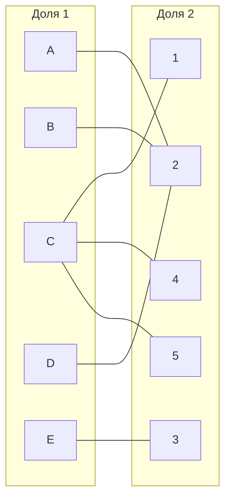

Выберем произвольное паросочетание A --- 2, C --- 4, E --- 3 и попытаемся построить совершенное паросочетание с помощью чередующихся деревьев.

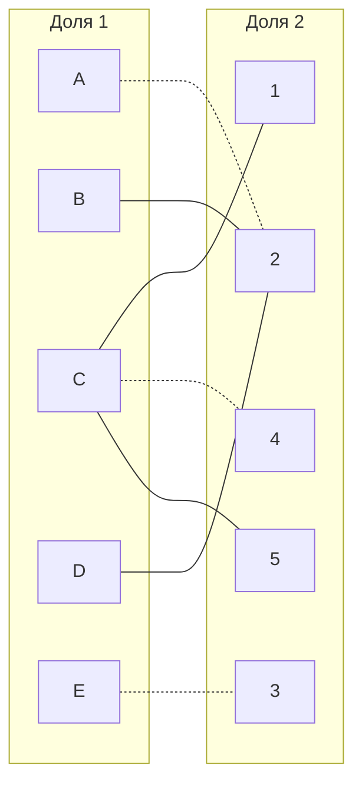

Попытаемся построить дерево из оставшихся непокрытых вершины B и D.

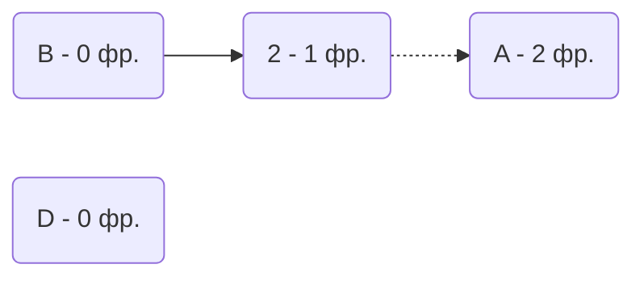
Из вершины D мы не можем пойти в вершину 2, так как она занята уже вершиной В.
В построенном дереве нет цепей, чередующееся относительно текущего паросочетания, построенная ветка закончилась в покрытой вершине, то есть в указанном графе нет совершенного паросочетания.

3. Проведем повторную редукцию матрицы затрат.

Во множество X выпишем все **покрытые построенным деревом** вершины первой доли графа, во множество Y все **покрытые построенным деревом** вершины из второй доли графа.

$$
X = \{A, B, D\};\
Y = \{ 2 \}
$$

Необходимо найти минимальный элемент из строк, включенных во множество X и столбцов, не включенных во множество Y. В нашем случае это будут строки A, B, D и столбцы 1, 3, 4, 5. Минимальный элемент 1, расположен в строке A и столбце 1. 

Вычтем найденное значение из строк множества X и прибавим к столбцам множества Y:

|       | **1** | **2** | **3** | **4** | **5** |     | 
|-------|:-----:|:-----:|:-----:|:-----:|:-----:|:---:|
| **A** |  0    |   0   |  8    |   1   |  4    |  -1 |
| **B** |  7    |   0   |   4   |  8    |   1   |  -1 |
| **C** |  0    |   9   |   8   |  0    |   0   |     |
| **D** |  3    |   0   |  4    |  8    |  13   | -1  |
| **E** |  5    |   2   |   0   |   3   |   4   |     |
|       |       |  +1   |       |       |       |     |

В ячейке A1 появилось новое нулевое значение, добавим соответствующее ребро в двудольный граф.

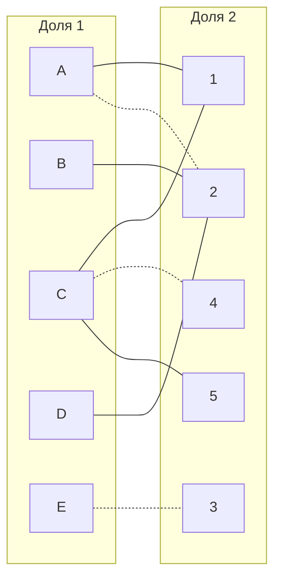

4. Попытаемся построить совершенное паросочетание с помощью чередующихся деревьев.

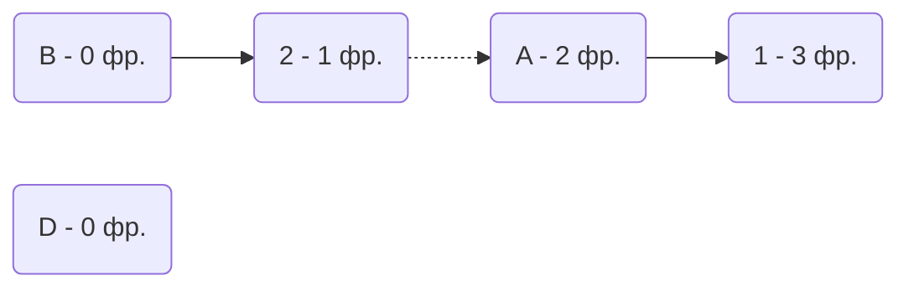

Из вершины D мы вновь не можем пойти в вершину 2, так как она занята вершиной В.
Построенное дерево содержит чередующуюся, относительно текущего паросочетания, цепь B2 - 2A - A1, цепь начинается и заканчивается в непокрытых вершинах, все ребра в цепи чередуются по вхождению в текущее паросочетание.

"Перекрасим" найденную цепь и проверим полученное паросочетание.

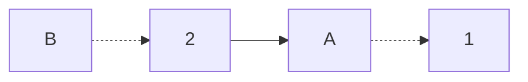

Попытаемся построить дерево из оставшейся непокрытой вершины D.

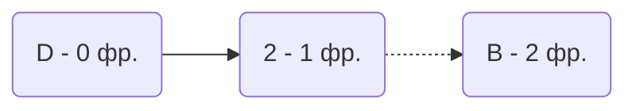
В построенном дереве нет цепей, чередующееся относительно текущего паросочетания, построенная ветка закончилась в покрытой вершине, то есть в указанном графе нет совершенного паросочетания, поэтому придется заново провести редукцию матрицы.

5. Проведем повторную редукцию матрицы затрат.
   
Во множество X выпишем все **покрытые построенным деревом** вершины первой доли графа, во множество Y все **покрытые построенным деревом** вершины из второй доли графа.

$$
X = \{B, D\};\
Y = \{ 2 \}
$$

Необходимо найти минимальный элемент из строк, включенных во множество X и столбцов, не включенных во множество Y. В нашем случае это будут строки B, D и столбцы 1, 3, 4, 5. Минимальный элемент 1, расположен в строке B и столбце 5. 

Вычтем найденное значение из строк множества X и прибавим к столбцам множества Y:

|       | **1** | **2** | **3** | **4** | **5** |     | 
|-------|:-----:|:-----:|:-----:|:-----:|:-----:|:---:|
| **A** |  0    |   1   |  8    |   1   |  4    |     |
| **B** |  6    |   0   |   3   |  7    |   0   |  -1 |
| **C** |  0    |   10  |   8   |  0    |   0   |     |
| **D** |  2    |   0   |  3    |  7    |  12   | -1  |
| **E** |  5    |   3   |   0   |   3   |   4   |     |
|       |       |  +1   |       |       |       |     |

В ячейке B5 появилось новое нулевое значение, добавим соответствующее ребро в двудольный граф.

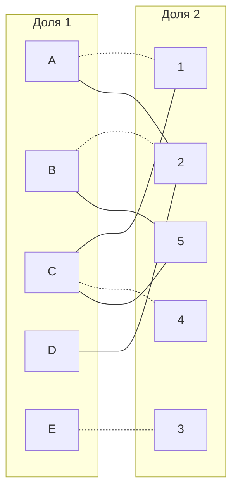

Попытаемся построить дерево из оставшейся непокрытой вершины D.

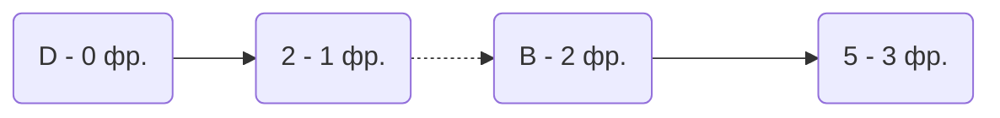
Построенное дерево содержит чередующуюся, относительно текущего паросочетания, цепь D2 - 2B - B5, цепь начинается и заканчивается в непокрытых вершинах, все ребра в цепи чередуются по вхождению в текущее паросочетание.

"Перекрасим" найденную цепь и проверим полученное паросочетание.

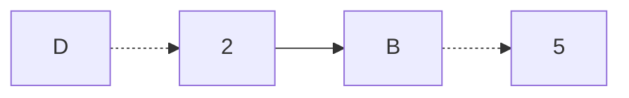
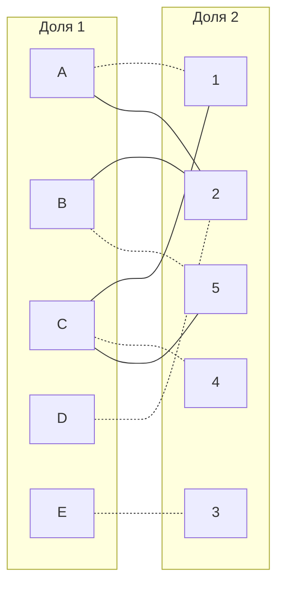

Полученное расписание является совершенным. Выпишем полученные назначения и их стоимости из исходной матрицы:
- A1 - 9
- B5 - 7
- C4 - 10
- D2 - 5
- E3 - 5

Общая стоимость затрат = 9 + 7 + 10 + 5 + 5 = 36.

## Ответ
Минимальная стоимость затрат 36, при следующих назначениях:
- задача A, исполнитель 1,
- задача B, исполнитель 5,
- задача C, исполнитель 4,
- задача D, исполнитель 2,
- задача E, исполнитель 3.