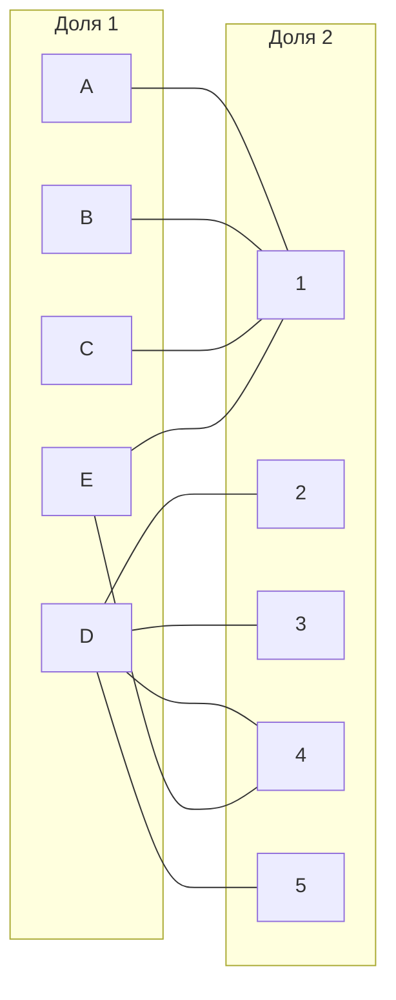
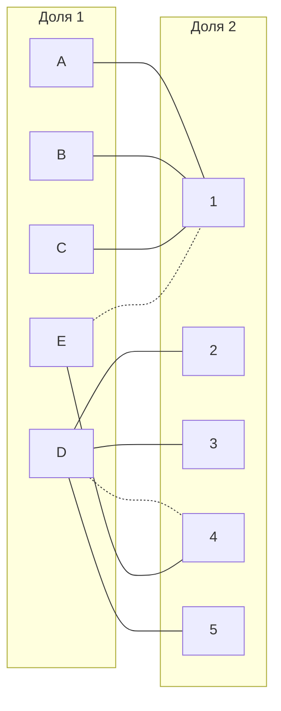
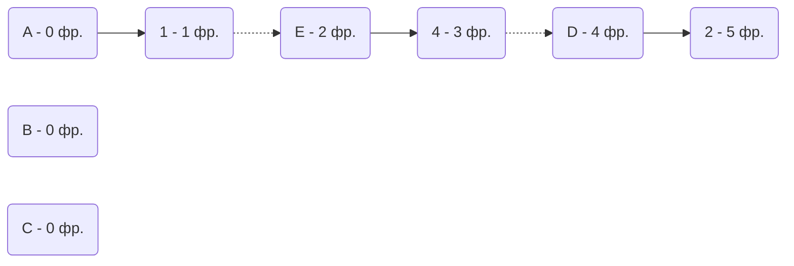
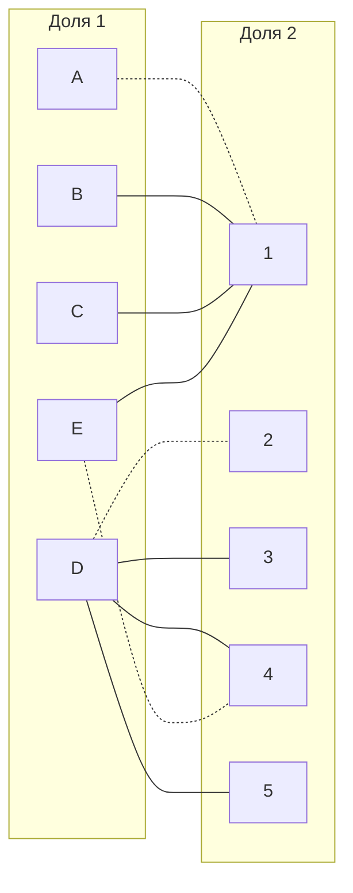
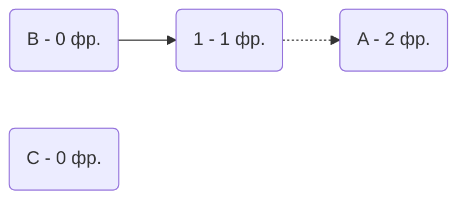
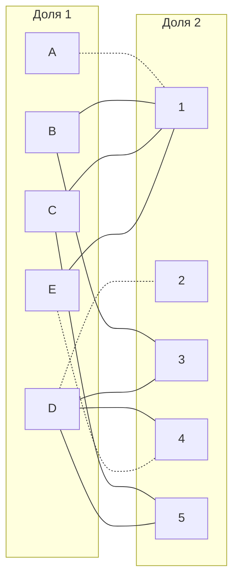
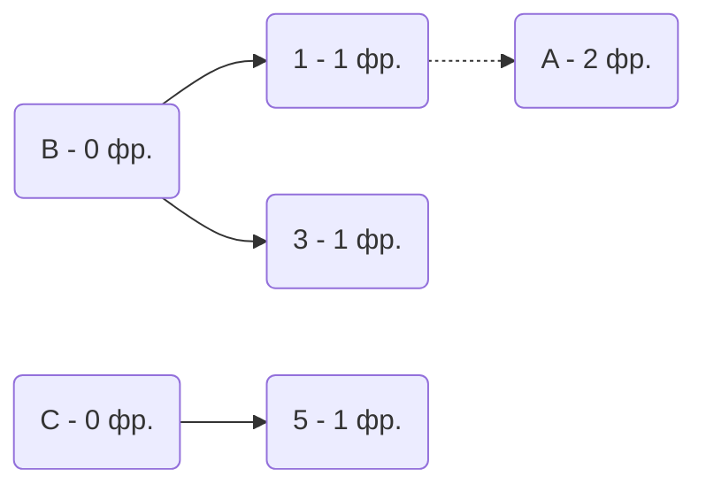
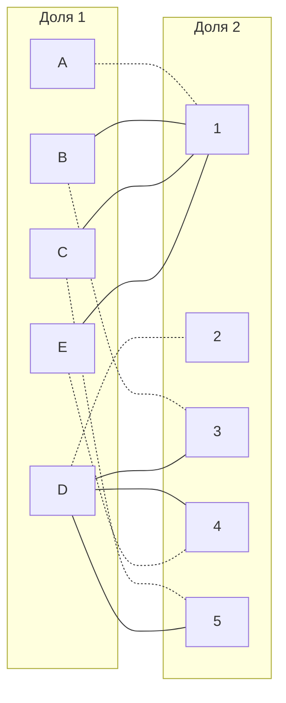

### Вариант 6

Матрица затрат

|       | **1** | **2** | **3** | **4** | **5** |
|-------|:-----:|:-----:|:-----:|:-----:|:-----:|
| **A** |   8   |  15   |  16   |  17   |  20   |
| **B** |   8   |  10   |   9   |  13   |  15   |
| **C** |   6   |  10   |  14   |  11   |   7   |
| **D** |  18   |  11   |  11   |  11   |  11   |
| **E** |   5   |  19   |  14   |   5   |   8   |

Редуцируем матрицу затрат сначала по строкам

|       | **1** | **2** | **3** | **4** | **5** | **MIN**|
|-------|:-----:|:-----:|:-----:|:-----:|:-----:|:----:|
| **A** |   0   |   7   |  8    |   9   |  12   |  -8  |
| **B** |   0   |   2   |  1    |   5   |   7   |  -8  |
| **C** |   0   |   4   |  8    |   5   |   1   |  -6  |
| **D** |   7   |   0   |  0    |   0   |   0   | -11  |
| **E** |   0   |  14   |  9    |   0   |   3   |  -5  |

Затем редуцируем матрицу по столбцам

|       | **1** | **2** | **3** | **4** | **5** |
|-------|:-----:|:-----:|:-----:|:-----:|:-----:|
| **A** |   **0**   |   7   |  8    |   9   |  12   |
| **B** |   **0**   |   2   |  1    |   5   |   7   |
| **C** |   **0**   |   4   |  8    |   5   |   1   |
| **D** |   7   |   **0**   |  **0**    |   **0**   |   **0**   |
| **E** |   **0**   |  14   |  9    |   **0**   |   3   |
| **MIN**|   **0**   |  **0**   |  **0**    |   **0**   |   **0**   |

После редуцирования по столбцам матрица не изменилась.

Отметим все нули в матрице. Нуль будет обозначать ребро графа.

Выберем произвольное паросочетание E --- 1, D --- 4 и попытаемся построить совершенное паросочетание с помощью чередующихся деревьев.

Тогда непокрытыми становятся вершины A, B, C.
Попытаемся построить дерево из непокрытых вершин 

Из вершин непокрытой вершины можно попасть в непокрытую вершину 2. Тогда Инвертируем полученные рёбра и получаем:

Снова попробуем построить цепь.

В графе нет цепей.
Проведём диагональную редукцию матрицы.

Во множество X выпишем все покрытые построенным деревом вершины
первой доли графа, во множество Y все покрытые построенным деревом
вершины из второй доли графа, то есть

X = {A, B, C}

Y = {1}

Необходимо найти минимальный элемент из строк, включенных во
множество X и столбцов, не включенных во множество Y.
То есть это столбцы 2, 3, 4, 5, а также строки B, C, A. Минимальный элемент 1. Прибавим это значение к столбцам, принадлежащим множеству Y, и вычтем в строчках множества X.

|       | **1** | **2** | **3** | **4** | **5** |**SUB**|
|-------|:-----:|:-----:|:-----:|:-----:|:-----:|:-----:|
| **A** |   0   |   6   |  7    |   8   |  11   |   -1  |
| **B** |   0   |   1   |  0    |   4   |   6   |   -1  |
| **C** |   0   |   3   |  7    |   4   |   0   |   -1  |
| **D** |   8   |   0   |  0    |   0   |   0   |   0   |
| **E** |   1   |  14   |  9    |   0   |   3   |   0   |
|**ADD**|   +1  |   0   |   0   |   0   |   0   |   0   |

B3 и C5 теперь содержал нули. Добавим эти рёбра в граф.

Попытаемся найти совершенное паросочетание с помощью построения цепи.
Непокрытые вершины не изменились.

Снова попробуем построить цепь.

Инвертируем цепи B-3 и C-5.

Непокрытых вершин не осталось. Получается готовое совершенное паросочетание: A-1, B-3, C-5, E-4, D-2. Тогда посчитаем общую стоимость: S = 8+9+7+5+11 = 40.

## Ответ
Минимальная стоимость затрат 40 единиц, если распределить задачи следующим образом:
* A - задача 1;
* B - задача 3;
* C - задача 5;
* E - задача 4;
* D - задача 2.