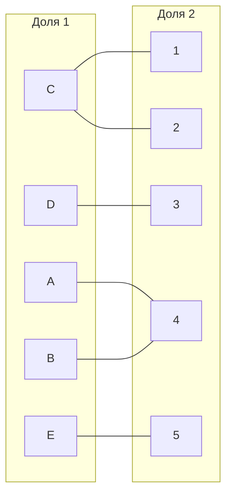
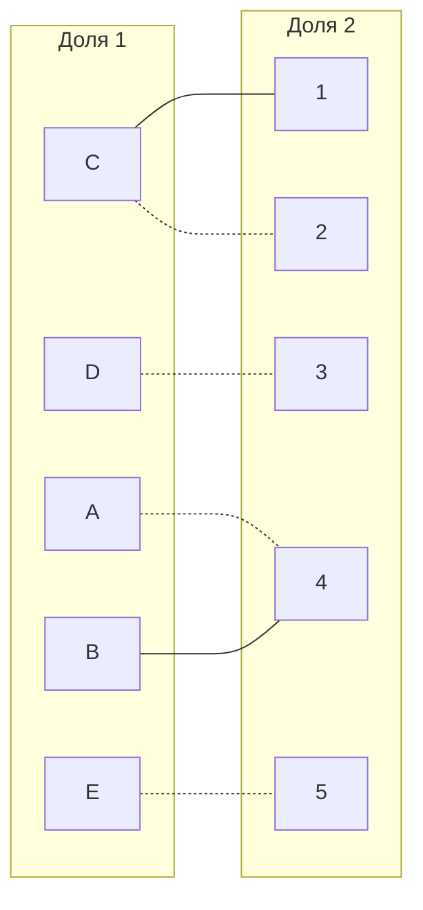
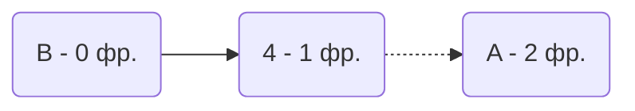
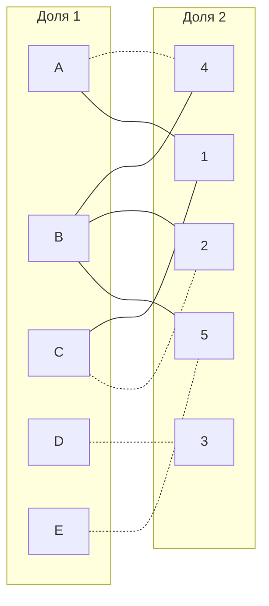
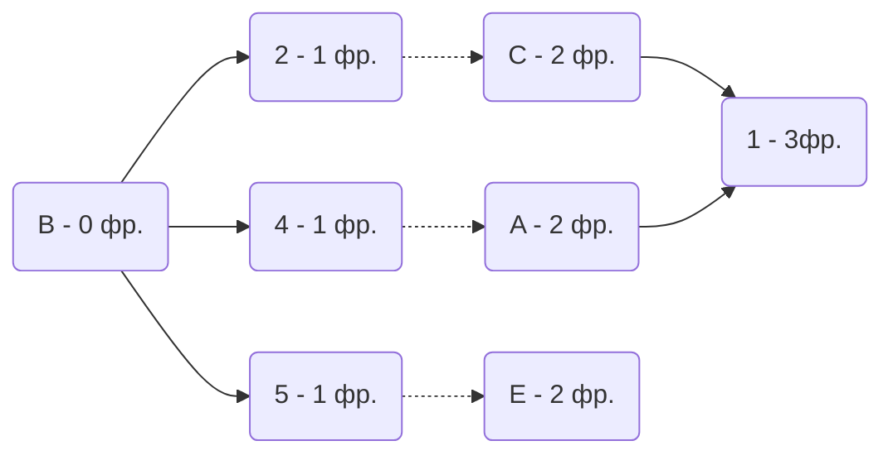
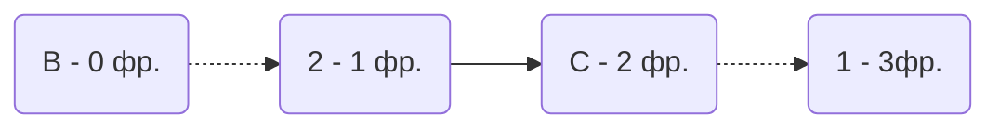
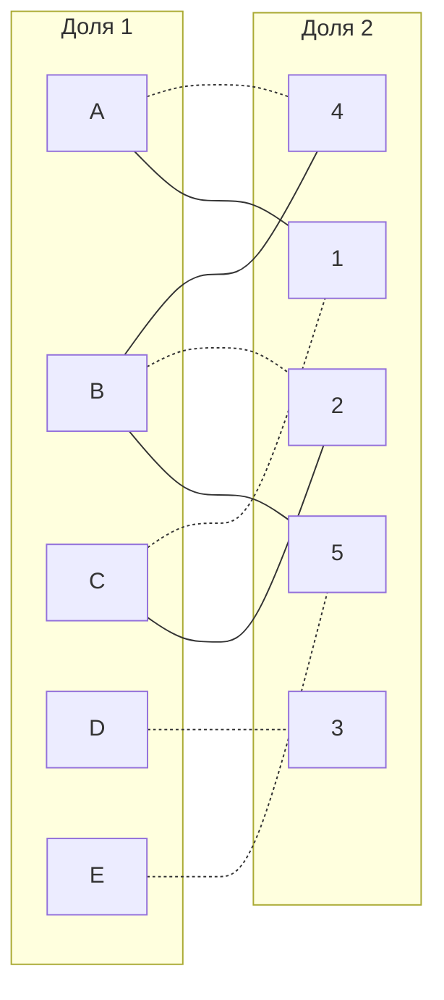

# Задание №8. Вариант №8.
# Задача о назначениях. Венгерский алгоритм.

## Условия варианта №8
### Матрица затрат:

|       | **1** | **2** | **3** | **4** | **5** |
|-------|:-----:|:-----:|:-----:|:-----:|:-----:|
| **A** |  11   |  20   |  20   |   8   |  12   |
| **B** |  17   |   9   |  13   |   5   |   8   |
| **C** |   6   |   7   |  16   |  20   |   9   |
| **D** |  18   |  20   |   6   |   9   |   7   |
| **E** |  16   |  15   |  18   |  11   |   9   |

### Решение

1. Проведем редукцию матрицы затрат. Вычтем из каждой строки минимальное значение, представленное в этой строке.

|       | **1** | **2** | **3** | **4** | **5** | **Min** |
|-------|:-----:|:-----:|:-----:|:-----:|:-----:|:-------:|
| **A** |  11   |  20   |  20   |   8   |  12   |   -8    |
| **B** |  17   |   9   |  13   |   5   |   8   |   -5    |
| **C** |   6   |   7   |  16   |  20   |   9   |   -6    |
| **D** |  18   |  20   |   6   |   9   |   7   |   -6    |
| **E** |  16   |  15   |  18   |  11   |   9   |   -9    |

После чего вычтем из каждого столбца минимальное значение, представленное в этом столбце.

|       | **1** | **2** | **3** | **4** | **5** |
|-------|:-----:|:-----:|:-----:|:-----:|:-----:|
| **A** |   3   |  12   |  12   |   0   |   4   |
| **B** |  12   |   4   |   8   |   0   |   3   |
| **C** |   0   |   1   |  10   |  14   |   3   |
| **D** |  12   |  14   |   0   |   3   |   1   | 
| **E** |   7   |   6   |   9   |   2   |   0   | 
|**Min**|   0   |   1   |   0   |   0   |   0   |

Получим редуцированную матрицу, где нули обозначают наименее затратные варианты назначений.

|       | **1** | **2** | **3** | **4** | **5** |
|-------|:-----:|:-----:|:-----:|:-----:|:-----:|
| **A** |   3   |  11   |  12   |   0   |   4   |
| **B** |  12   |   3   |   8   |   0   |   3   |
| **C** |   0   |   0   |  10   |  14   |   3   |
| **D** |  12   |  13   |   0   |   3   |   1   | 
| **E** |   7   |   5   |   9   |   2   |   0   | 

2. Построим двудольный граф, вынесем на него те ребра, для которых в редуцированной матрице указаны нули.

Выберем произвольное паросочетание C --- 2, D --- 3, A --- 4, E --- 5 и попытаемся построить совершенное паросочетание с помощью чередующихся деревьев.

Попытаемся построить дерево из оставшихся непокрытых вершины B.

В построенном дереве нет цепей, чередующееся относительно текущего паросочетания, построенная ветка закончилась в покрытой вершине, то есть в указанном графе нет совершенного паросочетания.

3. Проведем повторную редукцию матрицы затрат.

Во множество X выпишем все **покрытые построенным деревом** вершины первой доли графа, во множество Y все **покрытые построенным деревом** вершины из второй доли графа.

$$
X = \{A, B\};\
Y = \{ 4 \}
$$

Необходимо найти минимальный элемент из строк, включенных во множество X и столбцов, не включенных во множество Y. В нашем случае это будут строки A, B и столбцы 1, 2, 3, 5. Минимальный элемент 3, расположен в строке A и столбце 1. 

Вычтем найденное значение из строк множества X и прибавим к столбцам множества Y:

|       | **1** | **2** | **3** | **4** | **5** |       |
|-------|:-----:|:-----:|:-----:|:-----:|:-----:|:-----:|
| **A** |   3   |  11   |  12   |   0   |   4   |  -3   |
| **B** |  12   |   3   |   8   |   0   |   3   |  -3   |
| **C** |   0   |   0   |  10   |  14   |   3   |       |
| **D** |  12   |  13   |   0   |   3   |   1   |       | 
| **E** |   7   |   5   |   9   |   2   |   0   |       |
|       |       |       |       |   +3  |       |       |

Новая матрица затрат:

|       | **1** | **2** | **3** | **4** | **5** |
|-------|:-----:|:-----:|:-----:|:-----:|:-----:|
| **A** |   0   |   8   |   9   |   0   |   1   |
| **B** |   9   |   0   |   5   |   0   |   0   | 
| **C** |   0   |   0   |  10   |  17   |   3   |
| **D** |  12   |  13   |   0   |   6   |   1   | 
| **E** |   7   |   5   |   9   |   5   |   0   |

В ячейках: A1, B2 и B5 появились новые нулевые значения, добавим соответствующие ребра в двудольный граф.

Попытаемся построить дерево из оставшейся непокрытой вершины B.

Нашли чередующеюся цепь:

"Перекрасим" найденную цепь и проверим полученное паросочетание.

- A4 - 8
- B2 - 9
- C1 - 6
- D3 - 6
- E5 - 9

Общая стоимость затрат = 8 + 9 + 6 + 6 + 9 = 38.

## Ответ
Минимальная стоимость затрат 38, при следующих назначениях:
- задача A, исполнитель 4;
- задача B, исполнитель 2;
- задача C, исполнитель 1;
- задача D, исполнитель 3;
- задача E, исполнитель 5.