# Задача о назначениях. Венгерский алгоритм. Вариант 2.

### Матрица затрат:

|   | 1  | 2  | 3  | 4  | 5  |
|:-:|:--:|:--:|:--:|:--:|:--:|
| A | 19 | 19 | 14 | 10 | 14 |
| B | 17 | 18 | 11 | 16 | 11 |
| C | 13 | 5  | 18 | 20 | 10 |
| D | 14 | 5  | 9  | 12 | 20 |
| E | 15 | 7  | 14 | 8  | 16 |

## Решение

### 1. Проведем редукцию матрицы затрат
Найдём минимальное значение в каждой строке, после чего вычтем найденное значение из каждой ячейки соответствующей строки.

|       | **1** | **2** | **3** | **4** | **5** | _**Min**_ |
|:-----:|:-----:|:-----:|:-----:|:-----:|:-----:|:---------:|
| **A** |   9   |   9   |   4   |   0   |   4   |   _-10_   |
| **B** |   6   |   7   |   0   |   5   |   0   |   _-11_   |
| **C** |   8   |   0   |  13   |  15   |   5   |   _-5_    |
| **D** |   9   |   0   |   4   |   7   |  15   |   _-5_    |
| **E** |   8   |   0   |   7   |   1   |   9   |   _-7_    |

Найдём минимальное значение в каждом столбце, после чего вычтем найденное значение из каждой ячейки соответствующего столбца.

|           | **1** | **2** | **3** | **4** | **5** |
|:---------:|:-----:|:-----:|:-----:|:-----:|:-----:|
|   **A**   |   3   |   9   |   4   | **0** |   4   |
|   **B**   | **0** |   7   | **0** |   5   | **0** |
|   **C**   |   2   | **0** |  13   |  15   |   5   |
|   **D**   |   3   | **0** |   4   |   7   |  15   |
|   **E**   |   2   | **0** |   7   |   1   |   9   |
| _**Min**_ |  _-6_   | _-0_  | _-0_  | _-0_  | _-0_  |

Получили редуцированную матрицу. Ячейки с нулями обозначают наименее затратные варианты назначений.

### 2. Построим двудольный граф
Вынесем на него те ребра, для которых в редуцированной матрице указаны нули.

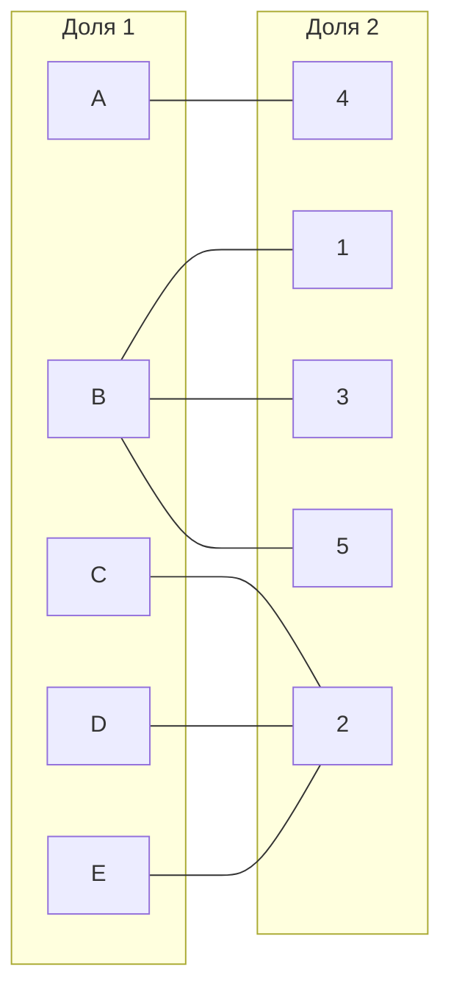

Выберем произвольное паросочетание A --- 4, B --- 1, E --- 2 и попытаемся построить совершенное паросочетание с помощью чередующихся деревьев.

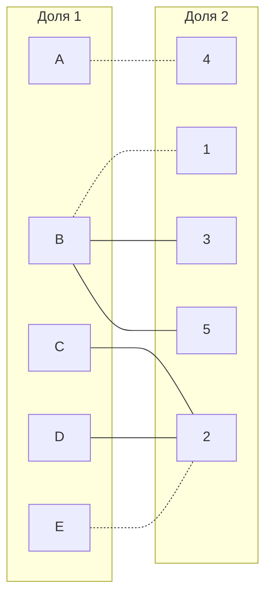

Попытаемся построить дерево из оставшихся непокрытых вершины C и D.

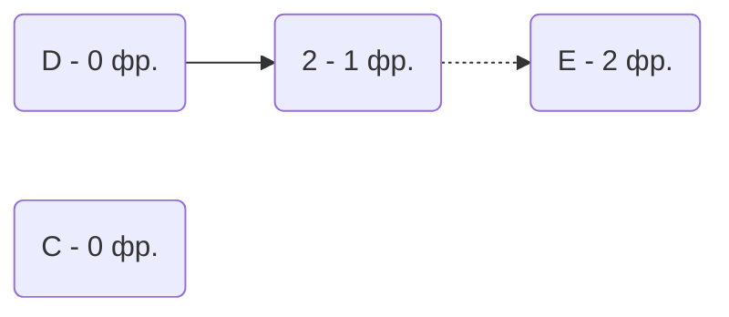
Из вершины C мы не можем пойти в вершину 2, так как она занята уже вершиной D.
В построенном дереве нет цепей, чередующееся относительно текущего паросочетания, построенная ветка закончилась в покрытой вершине, то есть в указанном графе нет совершенного паросочетания.

### 3. Проведем повторную редукцию матрицы затрат

Во множество X выпишем все **покрытые построенным деревом** вершины первой доли графа, во множество Y все **покрытые построенным деревом** вершины из второй доли графа.

$$
X = \{C, D, E\};\
Y = \{2\}
$$

Необходимо найти минимальный элемент из строк, включенных во множество X и столбцов, не включенных во множество Y. В нашем случае это будут строки C, D, E и столбцы 1, 3, 4, 5. Минимальный элемент 1, расположен в строке E и столбце 4. 

Вычтем найденное значение из строк множества X и прибавим к столбцам множества Y:

|           | **1** | **2** | **3** | **4** | **5** |    |
|:---------:|:-----:|:-----:|:-----:|:-----:|:-----:|:--:|
|   **A**   |   3   |  10   |   4   | **0** |   4   |    |
|   **B**   | **0** |   8   | **0** |   5   | **0** |    |
|   **C**   |   1   | **0** |  12   |  14   |   4   | -1 |
|   **D**   |   2   | **0** |   3   |   6   |  14   | -1 |
|   **E**   |   1   | **0** |   6   |   0   |   8   | -1 |
|           |       |  +1   |       |       |       |    |

В ячейке Е4 появилось новое нулевое значение, добавим соответствующее ребро в двудольный граф.

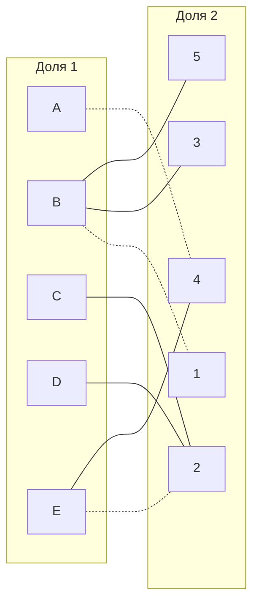

### 4. Попытаемся построить совершенное паросочетание с помощью чередующихся деревьев

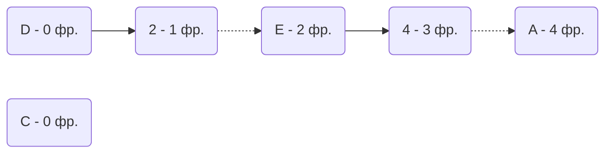

Из вершины C мы вновь не можем пойти в вершину 2, так как она занята вершиной D.

В построенном дереве нет цепей, чередующееся относительно текущего паросочетания, построенная ветка закончилась в покрытой вершине, то есть в указанном графе нет совершенного паросочетания, поэтому придется заново провести редукцию матрицы.

### 5. Проведем повторную редукцию матрицы затрат
   
Во множество X выпишем все **покрытые построенным деревом** вершины первой доли графа, во множество Y все **покрытые построенным деревом** вершины из второй доли графа.

$$
X = \{A, C, D, E\};\
Y = \{ 2, 4 \}
$$

Необходимо найти минимальный элемент из строк, включенных во множество X и столбцов, не включенных во множество Y. В нашем случае это будут строки C, D и столбцы 1, 3, 4, 5. Минимальный элемент 1, расположен в строке C и столбце 1. 

Вычтем найденное значение из строк множества X и прибавим к столбцам множества Y:

|           | **1** | **2** | **3** | **4** | **5** |    |
|:---------:|:-----:|:-----:|:-----:|:-----:|:-----:|:--:|
|   **A**   |   2   |  10   |   3   | **0** |   3   | -1 |
|   **B**   | **0** |   9   | **0** |   6   | **0** |    |
|   **C**   | **0** | **0** |  11   |  14   |   3   | -1 |
|   **D**   |   1   | **0** |   2   |   6   |  13   | -1 |
|   **E**   | **0** | **0** |   5   | **0** |   7   | -1 |
|           |       |  +1   |       |  +1   |       |    |

В ячейке C1 и Е1 появились новые нулевые значения, добавим соответствующие ребра в двудольный граф.

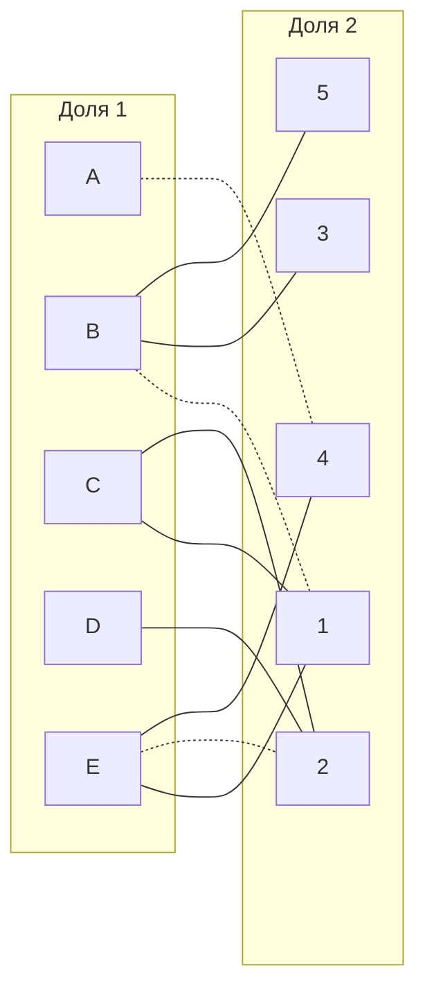

Попытаемся построить дерево из оставшейся непокрытой вершины C.

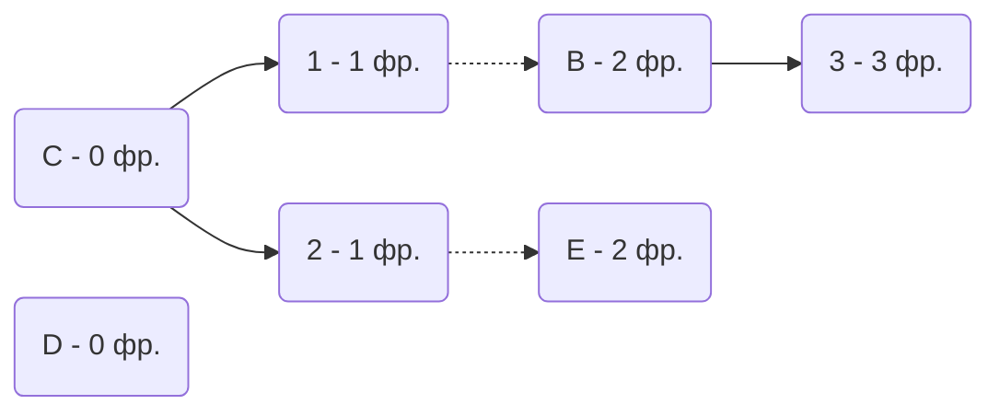

В этом случае 2 вершина занята вершиной C. "Перекрасим" ветку С1 - 1B - B3, т.к. цепь начинается и заканчивается в незакрашенных вершинах.

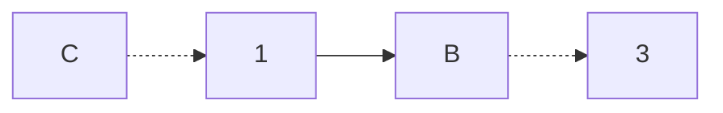

Отразим изменения в двудольном графе.

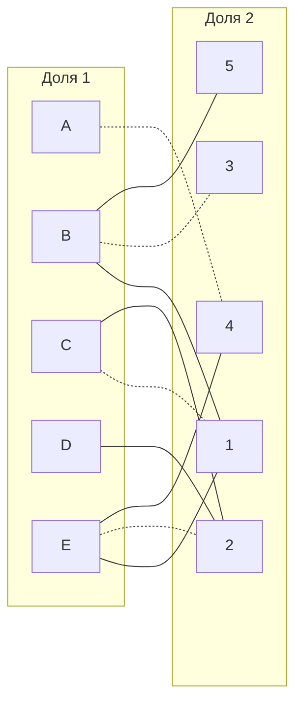
Попытаемся построить дерево из оставшейся непокрытой вершины D.

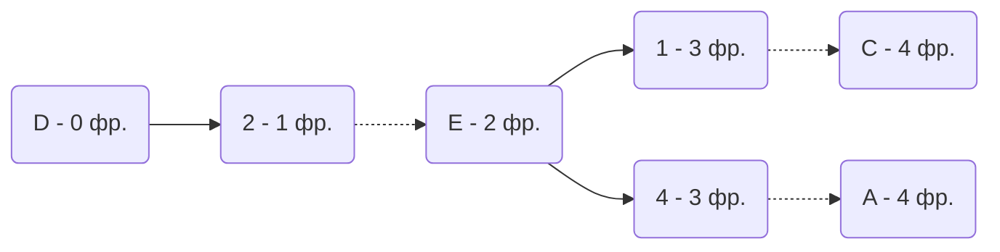

В построенном дереве нет цепей, чередующееся относительно текущего паросочетания, построенная ветка закончилась в покрытой вершине, то есть в указанном графе нет совершенного паросочетания, поэтому придется заново провести редукцию матрицы.

### 6. Проведем повторную редукцию матрицы затрат

Во множество X выпишем все **покрытые построенным деревом** вершины первой доли графа, во множество Y все **покрытые построенным деревом** вершины из второй доли графа.

$$
X = \{A, C, D, E\};\
Y = \{1, 2, 4\}
$$

Необходимо найти минимальный элемент из строк, включенных во множество X и столбцов, не включенных во множество Y. В нашем случае это будут строки C, D и столбцы 1, 3, 4, 5. Минимальный элемент 1, расположен в строке C и столбце 1. 

Вычтем найденное значение из строк множества X и прибавим к столбцам множества Y:

|           | **1** | **2** | **3** | **4** | **5** |    |
|:---------:|:-----:|:-----:|:-----:|:-----:|:-----:|:--:|
|   **A**   |   2   |  10   |   3   | **0** |   3   | -2 |
|   **B**   | **0** |   9   | **0** |   6   | **0** |    |
|   **C**   | **0** | **0** |  11   |  14   |   3   | -2 |
|   **D**   |   1   | **0** |   2   |   6   |  13   | -2 |
|   **E**   | **0** | **0** |   5   | **0** |   7   | -2 |
|           |  +2   |  +2   |       |  +2   |       |    |

Мы видим, что при вычитании ит прибавлении в ячейке D3 значение изменится на 0. В двудольном графе указываем это изменение, добавляя необходимое ребро.

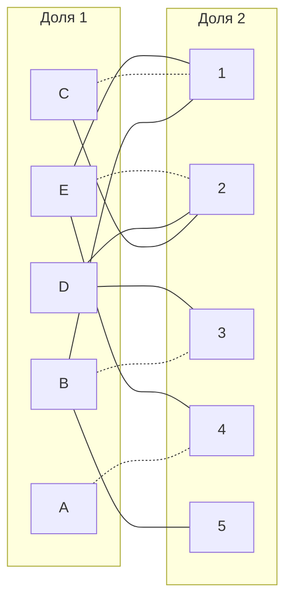

Пробуем построить дерево из всё той же непокрытой вершины D.

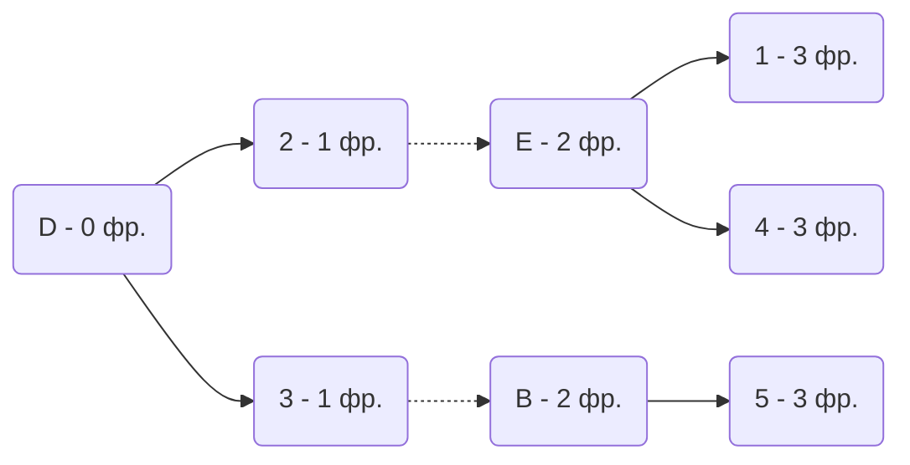

При построении дерева наткнулись на тупик на 3 фронте, в цепи D3 - 3B - B5. Цепь заканчивается в непокрашенных вершинах, инвертируем её.

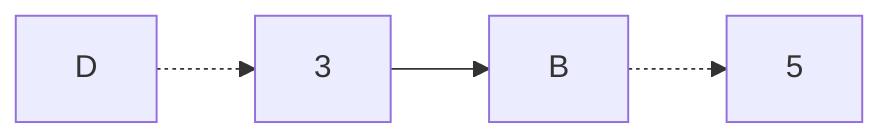
Отобразим изменения в двудольном графе.
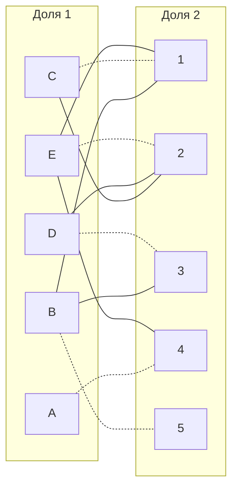

Все исполнители заняты, все задачи назначены, следовательно, граф совершенный.  
Итоговые назначения:  
С - 1  
Е - 2  
D - 3  
A - 4  
B - 5  

Общая стоимость всех работ:  
13+7+9+10+11 = 50

## Ответ
Минимальная стоимость затрат 50, при следующих назначениях:
- задача A, исполнитель 4,
- задача B, исполнитель 5,
- задача C, исполнитель 1,
- задача D, исполнитель 3,
- задача E, исполнитель 2.