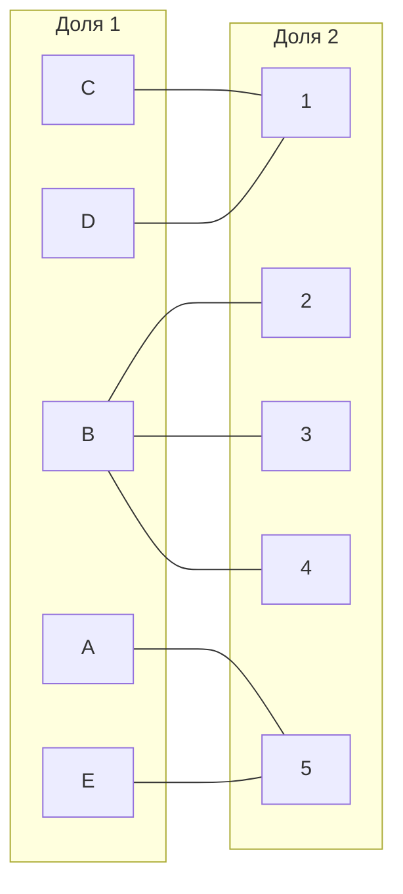
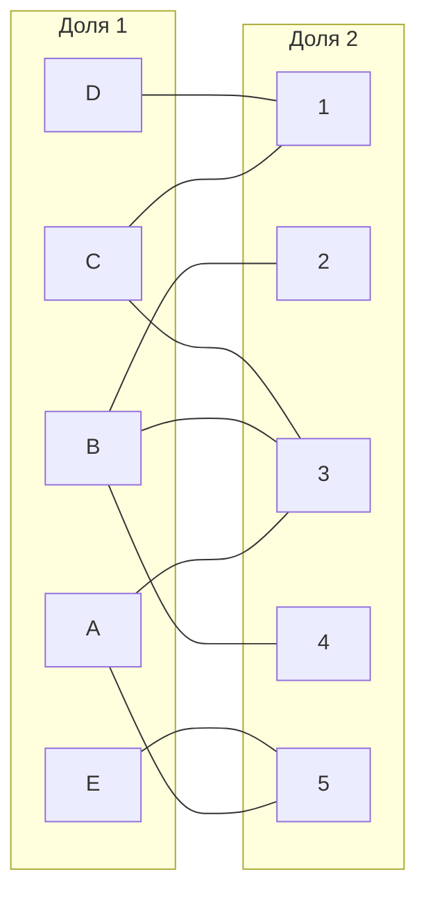
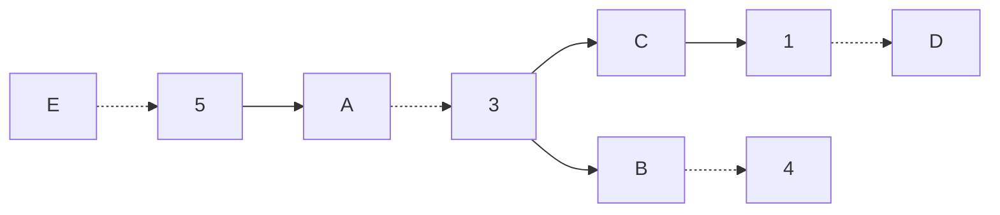
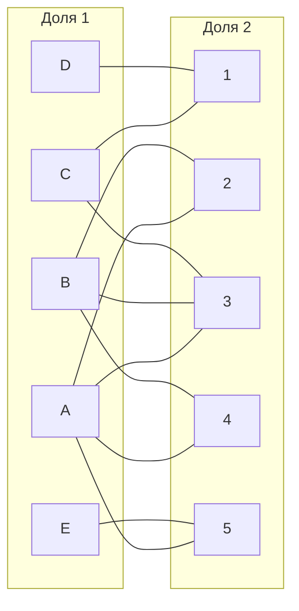
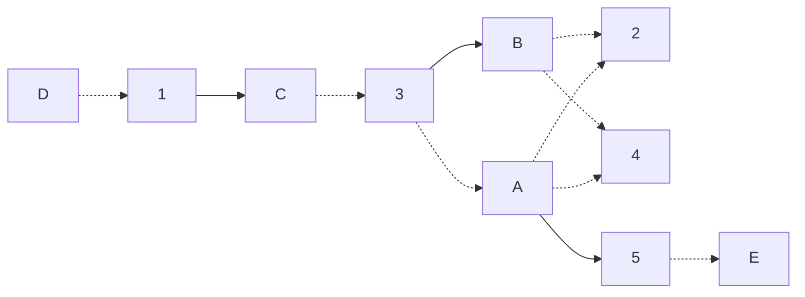
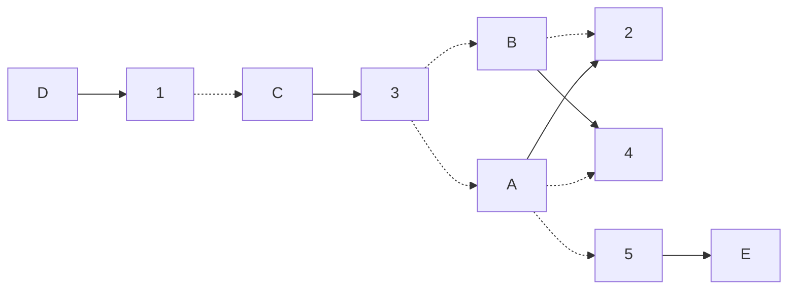

## Венгерский алгоритм. Задача о назначениях (вариант ~4)

|   | 1 | 2 | 3 | 4 | 5 | 6 |
|---|---|---|---|---|---|---|
| A | 1 | 5 | 10 | 9 | 4 | 5 |
| B | 13 | 7 | 5 | 5 | 11 | 8 |
| C | 7 | 11 | 5 | 9 | 11 | 14 |
| D | 5 | 13 | 16 | 20 | 17 | 12 |
| E | 12 | 20 | 19 | 7 | 13 | 7 |

### Решение

1. Выполним редукцию марицы затрат

1.1. По строкам

|   | 1 | 2 | 3 | 4 | 5 |
|---|---|---|---|---|---|
| A | 12 | 3 | 2 | 3 | 0 |
| B | 8 | 0 | 0 | 0 | 13 |
| C | 0 | 4 | 2 | 4 | 7 |
| D | 0 | 8 | 11 | 15 | 12 |
| E | 5| 13 | 13 | 6 | 0 |

1.2. По столбцам

|   | 1 | 2 | 3 | 4 | 5 |
|---|---|---|---|---|---|
| A | 13 | 3 | 2 | 3 | 0 |
| B | 8 | 0 | 0 | 0 | 13 |
| C | 0 | 4 | 2 | 4 | 2 |
| D | 0 | 8 | 11 | 15 | 12 |
| E | 5 | 13 | 13 | 6 | 0 |

т.к. в каждом столбце уже был 0, матрица не изм.

2. Построим двудольный граф наиболе выгодных значений.

Максимальное паросочетание в этом графе модержит 3 ребра, а нужно 5.

Возьмем паросочетание { A-5. B-2, C-1 }.
Построить чередующуюся цепь невозможно, значит необходимо добавить новые ребра.

3. Проведем диагональную редукцию матрицы

|   | 1 | 2 | 3 | 4 | 5 |   |
|---|---|---|---|---|---|---|
| B | 10 | 0 | 0 | 0 | 15 |     |
| A | 12 | 1 | 0 | 1 | 0 | (-2) |
| C | 0 | 2 | 0 | 2 | 7 | (-2) |
| D | 0 | 6 | 9 | 13 | 12 | (-2) |
| E | 5 | 11 | 11 | 4 | 0 | (-2) |
|   |+2 |    |    |   | +2 |      |

Появилочь 2 новых ребра: A-3 и C-3. Включим их в граф:

Построим через цепь: 

Цепь найдена, значит можно увеличить паросочетания, инвертировав цвета ребер { E-5, A-3, B-4, C-1 }

Максимальное паросочетание содержит 4 ребра вместо 5, значит необходимо добавить больше ребер в цепь.
Проведем диагональную редуцию матрицы: 

|   | 1 | 2 | 3 | 4 | 5 |   |
|---|---|---|---|---|---|---|
| B | 11 | 0 | 0 | 0 | 0 | -1 |
| A | 10 | 0 | 1 | 0 | 16 |   |
| C | 0 | 2 | 1 | 2 | 8 |  |
| D | 0 | 6 | 10 | 13 | 13 |   |
| E | 5 | 11 | 12 | 4 | 1 |   |
|   |   |    | +1 |   | +1 |   |

Добавилось 2 новых ребра: A-2 и A-4

Построим чередующуяся цепь: 

Инвртируем цепь: 

Таким образом назначения: { A-2, -4, C-3, D-1, E-5 }.
Ответ: сумма затрат = 10 + 5 + 9 + ? = 36