# Вариант 7

Дана матрица затрат для задач A, B, C, D и исполнителей 1, 2, 3, 4:

|       | **1** | **2** | **3** | **4** | **5** |
|-------|:-----:|:-----:|:-----:|:-----:|:-----:|
| **A** |  13   |  19   |   8   |  16   |   5   |
| **B** |   9   |  14   |   7   |  10   |  10   |
| **C** |  10   |  20   |   6   |   5   |  10   |
| **D** |  18   |  13   |   9   |  12   |  17   |
| **E** |  13   |  15   |  17   |  17   |  19   |

1. Проведем редукцию матрицы затрат. Вычтем из каждой строки минимальное значение, представленное в этой строке.

|       | **1** | **2** | **3** | **4** | **5** | **min** |
|-------|:-----:|:-----:|:-----:|:-----:|:-----:| :-----: |
| **A** |  8    |  14   |   3   |  11   |   0   | 5 |
| **B** |   2   |  7    |   0   |  3    |  3    | 7 |
| **C** |  5    |  15   |   1   |   0   |  5    | 5 |
| **D** |  9    |  4    |   0   |  3    |  8    | 9 |
| **E** |  0    |  2    |  4    |  4    |  6    | 13 |

2. После чего вычтем из каждого столбца минимальное значение, представленное в этом столбце.

|       | **1** | **2** | **3** | **4** | **5** | **min** |
|-------|:-----:|:-----:|:-----:|:-----:|:-----:| :-----: |
| **A** |  8    |  12   |   3   |  11   |   0   | 5 |
| **B** |   2   |  5    |   0   |  3    |  3    | 7 |
| **C** |  5    |  13   |   1   |   0   |  5    | 5 |
| **D** |  9    |  2    |   0   |  3    |  8    | 9 |
| **E** |  0    |  0    |  4    |  4    |  6    | 13 |
| **min**|   0  |   2   |   0   |   0   |   0   |

Получим редуцированную матрицу, где нули обозначают наименее затратные варианты назначений.

|       | **1** | **2** | **3** | **4** | **5** |
|-------|:-----:|:-----:|:-----:|:-----:|:-----:|
| **A** |  8    |  12   |   3   |  11   |   0   |
| **B** |   2   |  5    |   0   |  3    |  3    |
| **C** |  5    |  13   |   1   |   0   |  5    |
| **D** |  9    |  2    |   0   |  3    |  8    |
| **E** |  0    |  0    |  4    |  4    |  6    |

2. Построим двудольный граф, вынесем на него те ребра, для которых в редуцированной матрице указаны нули.

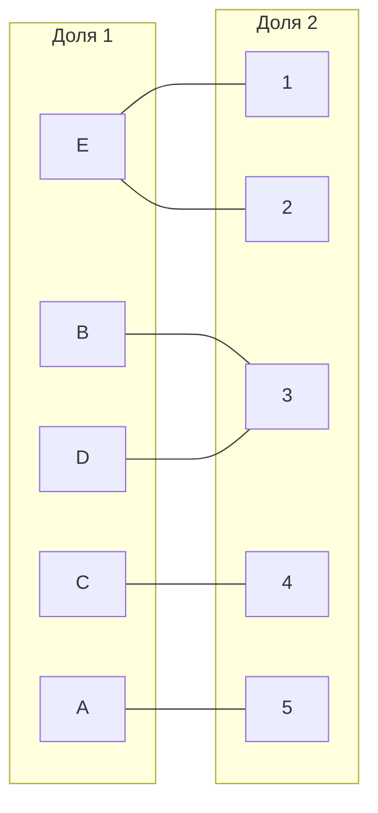

Выберем произвольное паросочетание E --- 1, B --- 3, C --- 4 и попытаемся построить совершенное паросочетание с помощью чередующихся деревьев.

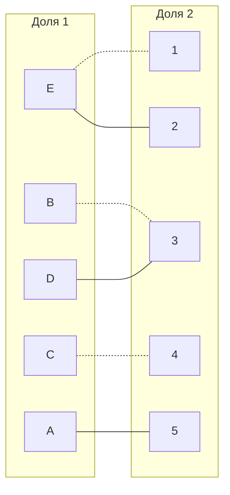

Попытаемся построить дерево из оставшихся непокрытых вершин A и D.

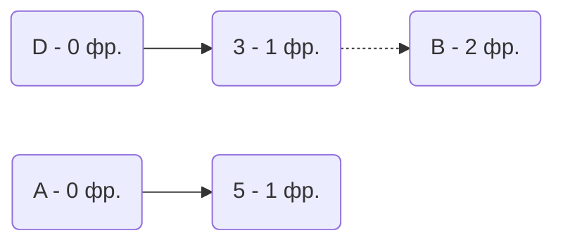

В построенном дереве нет цепей, чередующееся относительно текущего паросочетания, обе ветки закончились в покрытых вершинах, то есть в указанном графе нет совершенного паросочетания.

3. Проведем повторную редукцию матрицы затрат.

Во множество X выпишем все **покрытые построенным деревом** вершины первой доли графа, во множество Y все **покрытые построенным деревом** вершины из второй доли графа.

$$
X = \{A, B, D\}

Y = \{3, 5\}
$$

Необходимо найти минимальный элемент из строк, включенных во множество X и столбцов, не включенных во множество Y. В нашем случае это будут строки A, B, D и столбцы 1, 2, 4. Минимальный элемент 2, расположен в строке D и столбце 2. 

Вычтем найденное значение из строк множества X и прибавим к столбцам множества Y:

|       | **1** | **2** | **3** | **4** | **5** |
|-------|:-----:|:-----:|:-----:|:-----:|:-----:|
| **A** |  6    |  10   |   3   |  9   |   2   |
| **B** |   0   |  3    |   2   |  1    |  3    |
| **C** |  5    |  13   |   3   |   0   |  7    |
| **D** |  7    |  0    |   2   |  1    |  8    |
| **E** |  0    |  0    |  6    |  4    |  8    |

В ячейке B1 и D2 появились новые нулевые значения, добавим соответствующие ребра в двудольный граф.

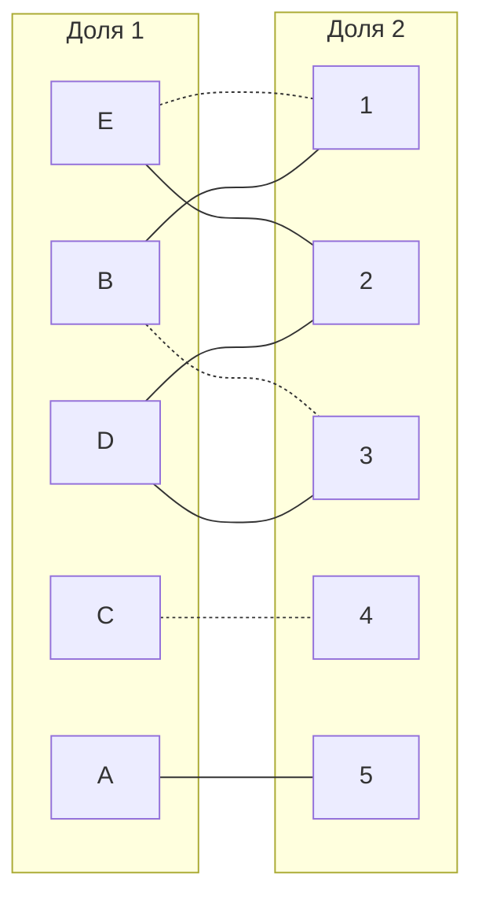

4. Попытаемся построить совершенное паросочетание с помощью чередующихся деревьев.

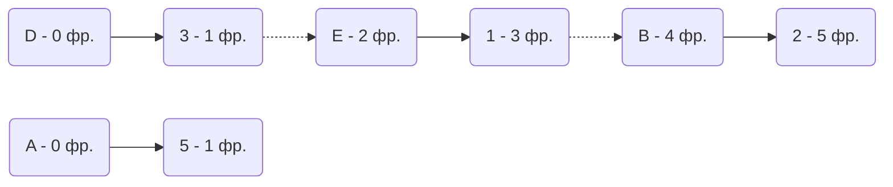

Построенное дерево содержит чередующуюся, относительно текущего паросочетания, цепь D3 - 3E - E1 - 1B - B2, цепь начинается и заканчивается в непокрытых вершинах, все ребра в цепи чередуются по вхождению в текущее паросочетание.

"Перекрасим" найденную цепь и проверим полученное паросочетание.

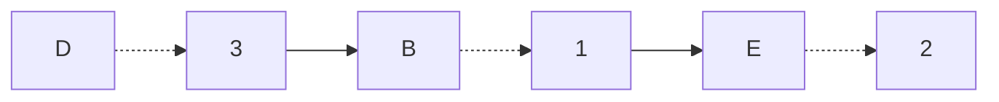

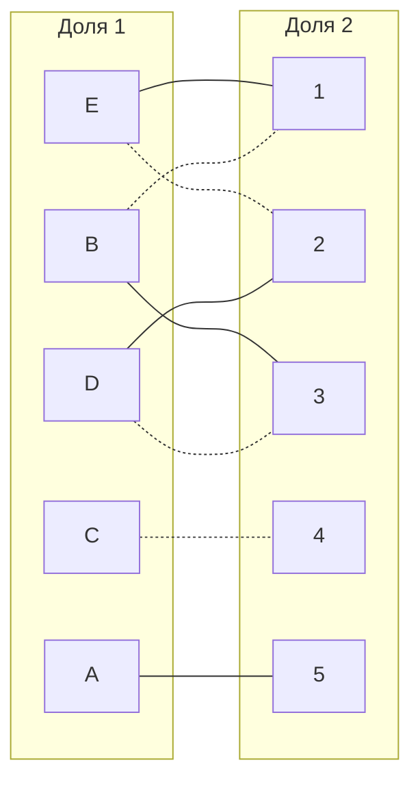
Текущее паросочетание [B, 1], [E, 2], [C, 3], [D, 4]

Построим чередующееся дерево от вершины A:
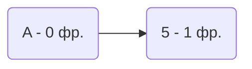

В построенном дереве нет цепей, чередующихся относительно текущего паросочетания, то есть в указанном графе нет совершенного паросочетания.

5. Диагональная редукция.
  
  Во множество X выпишем все покрытые построенным деревом вершины первой доли графа, во множество Y все покрытые построенным деревом вершины из второй доли графа.

  $$ X = {A} $$

  $$ Y = {5} $$

 Разделим на 4 сектора по столбцу A и строке 5. Получим:

  |       | **1** | **2** | **3** | **4** | **5** |
|-------|:-----:|:-----:|:-----:|:-----:|:-----:|
| **A** |  6    |  10   |   3   |  9   |   2   |
| **B** |   0   |  3    |   2   |  1    |  3    |
| **C** |  5    |  13   |   3   |   0   |  7    |
| **D** |  7    |  0    |   2   |  1    |  8    |
| **E** |  0    |  0    |  6    |  4    |  8    |
  
 Необходимо найти минимальный элемент из строк, включенных во множество X и столбцов, не включенных во множество Y.
 
 В нашем случае, это будут строка: А  и столбцы: 1, 2, 3, 4. Минимальный элемент 3, расположен в строке A и столбце 3.
 
 Вычтем найденное значение из строк множества X и прибавим к столбцам множества Y. Новая полученная матрица затрат:
 
   |       | **1** | **2** | **3** | **4** | **5** |
|-------|:-----:|:-----:|:-----:|:-----:|:-----:|
| **A** |  3    |  7   |   0   |  6   |   0   |
| **B** |   0   |  3    |   2   |  1    |  3    |
| **C** |  5    |  13   |   3   |   0   |  7    |
| **D** |  7    |  0    |   2   |  1    |  8    |
| **E** |  0    |  0    |  6    |  4    |  8    |
  
  В ячейке A3 и A5 появилось новое нулевое значение, добавим соответствующее ребро в двудольный граф.
  
  Получим:

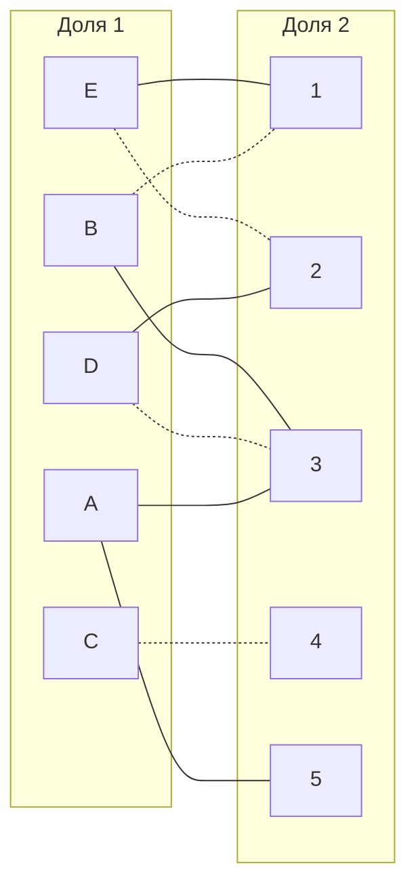
6. Попытаемся построить совершенное паросочетание с помощью чередующихся деревьев на основе обновленного графа.

  Построим чередующееся дерево от вершины E:

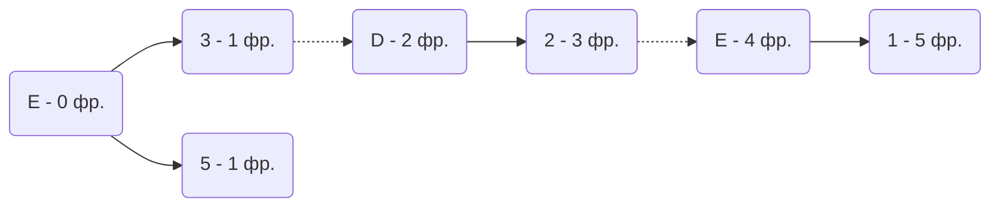

Построенное дерево содержит чередующуюся, относительно текущего паросочетания, цепь A3 - 3D - D2 - 2E - E1, цепь начинается и заканчивается в непокрытых вершинах, все ребра в цепи чередуются по вхождению в текущее паросочетание.

"Перекрасим" найденную цепь и проверим полученное паросочетание.

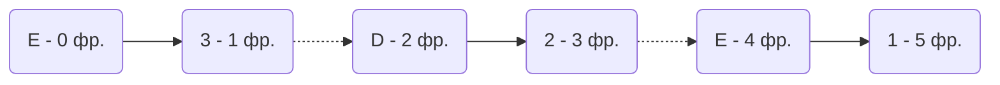

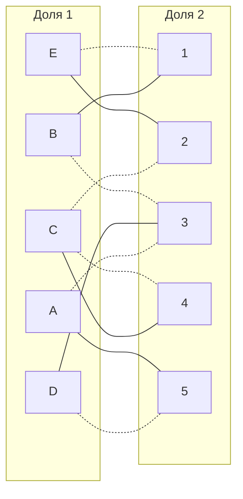

  Текущее паросочетание [E, 1], [A, 2], [B, 3], [C, 4], [D, 5]
  
  Нет непокрытых вершин в графе, а следовательно текущее паросочетание совершенное.

Полученное расписание является совершенным. Выпишем полученные назначения и их стоимости из исходной матрицы:
- E1 - 13
- A2 - 19
- B3 - 7
- C4 - 5
- D5 - 17
Общая стоимость затрат = 13 + 19 + 7 + 5 + 17 = 61.

## Ответ
Минимальная стоимость затрат 61, при следующих назначениях:
- задача E, исполнитель 1,
- задача A, исполнитель 2,
- задача B, исполнитель 3,
- задача C, исполнитель 4.
- задача D, исполнитель 5.
