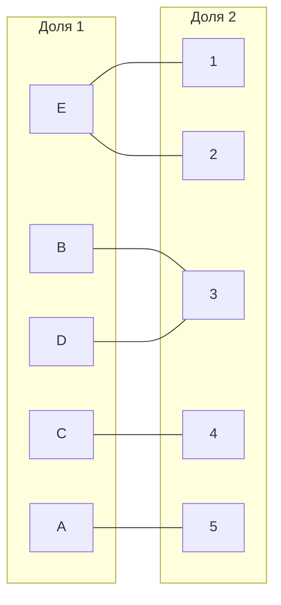
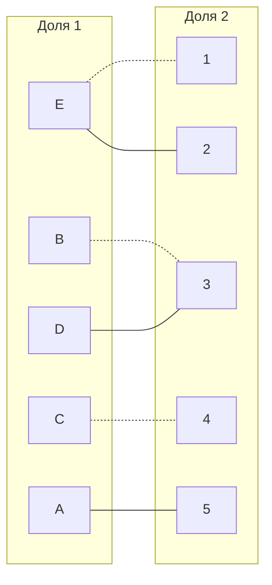
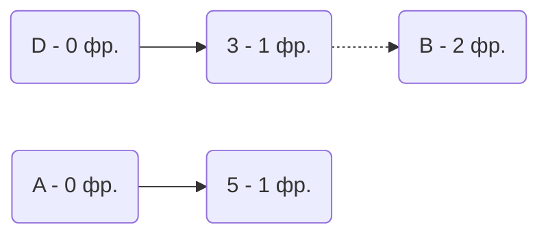
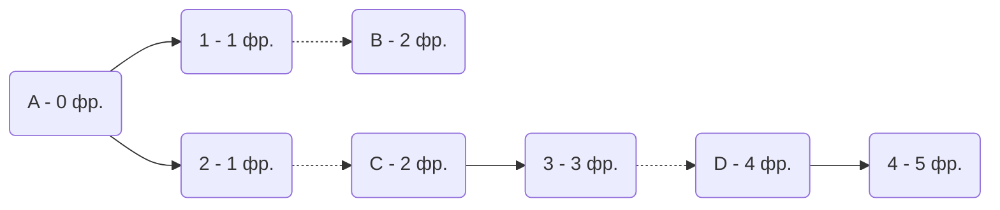
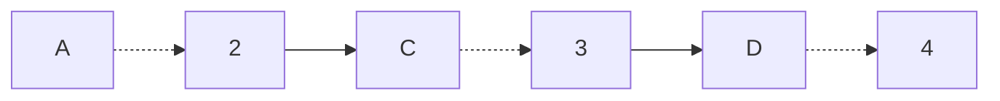
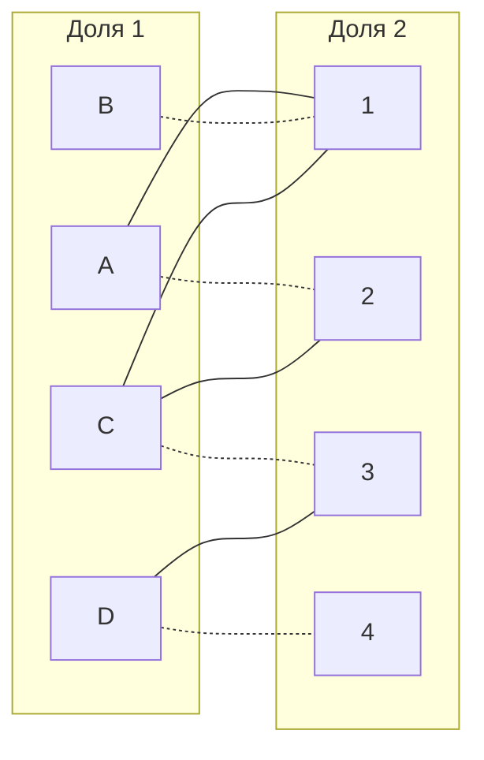

# Вариант 7

Дана матрица затрат для задач A, B, C, D и исполнителей 1, 2, 3, 4:

|       | **1** | **2** | **3** | **4** | **5** |
|-------|:-----:|:-----:|:-----:|:-----:|:-----:|
| **A** |  13   |  19   |   8   |  16   |   5   |
| **B** |   9   |  14   |   7   |  10   |  10   |
| **C** |  10   |  20   |   6   |   5   |  10   |
| **D** |  18   |  13   |   9   |  12   |  17   |
| **E** |  13   |  15   |  17   |  17   |  19   |

1. Проведем редукцию матрицы затрат. Вычтем из каждой строки минимальное значение, представленное в этой строке.

|       | **1** | **2** | **3** | **4** | **5** | **min** |
|-------|:-----:|:-----:|:-----:|:-----:|:-----:| :-----: |
| **A** |  8    |  14   |   3   |  11   |   0   | 5 |
| **B** |   2   |  7    |   0   |  3    |  3    | 7 |
| **C** |  5    |  15   |   1   |   0   |  5    | 5 |
| **D** |  9    |  4    |   0   |  3    |  8    | 9 |
| **E** |  0    |  2    |  4    |  4    |  6    | 13 |

2. После чего вычтем из каждого столбца минимальное значение, представленное в этом столбце.

|       | **1** | **2** | **3** | **4** | **5** | **min** |
|-------|:-----:|:-----:|:-----:|:-----:|:-----:| :-----: |
| **A** |  8    |  12   |   3   |  11   |   0   | 5 |
| **B** |   2   |  5    |   0   |  3    |  3    | 7 |
| **C** |  5    |  13   |   1   |   0   |  5    | 5 |
| **D** |  9    |  2    |   0   |  3    |  8    | 9 |
| **E** |  0    |  0    |  4    |  4    |  6    | 13 |
| **min**|   0  |   2   |   0   |   0   |   0   |

Получим редуцированную матрицу, где нули обозначают наименее затратные варианты назначений.

|       | **1** | **2** | **3** | **4** | **5** |
|-------|:-----:|:-----:|:-----:|:-----:|:-----:|
| **A** |  8    |  12   |   3   |  11   |   0   |
| **B** |   2   |  5    |   0   |  3    |  3    |
| **C** |  5    |  13   |   1   |   0   |  5    |
| **D** |  9    |  2    |   0   |  3    |  8    |
| **E** |  0    |  0    |  4    |  4    |  6    |

2. Построим двудольный граф, вынесем на него те ребра, для которых в редуцированной матрице указаны нули.

Выберем произвольное паросочетание E --- 1, B --- 3, C --- 4 и попытаемся построить совершенное паросочетание с помощью чередующихся деревьев.

Попытаемся построить дерево из оставшихся непокрытых вершин A и D.

## В построенном дереве нет цепей, чередующееся относительно текущего паросочетания, обе ветки закончились в покрытых вершинах, то есть в указанном графе нет совершенного паросочетания.

3. Проведем повторную редукцию матрицы затрат.

Во множество X выпишем все **покрытые построенным деревом** вершины первой доли графа, во множество Y все **покрытые построенным деревом** вершины из второй доли графа.

$$
X = \{A, B, C\}

Y = \{1, 2 \}
$$

Необходимо найти минимальный элемент из строк, включенных во множество X и столбцов, не включенных во множество Y. В нашем случае это будут строки A, B, C и столбцы 3, 4. Минимальный элемент 1, расположен в строке C и столбце 3. 

Вычтем найденное значение из строк множества X и прибавим к столбцам множества Y:

|       | **1** | **2** | **3** | **4** | **5** |
|-------|:-----:|:-----:|:-----:|:-----:|:-----:|
| **A** |   0   |   0   |   2   |   1   |  -1   |
| **B** |   0   |   2   |   3   |   5   |  -1   |
| **C** |   0   |   0   |   0   |   1   |  -1   |
| **D** |   2   |   2   |   0   |   0   |       |
| **E** |  +1   |  +1   |       |       |       |

В ячейке C3 появилось новое нулевое значение, добавим соответствующее ребро в двудольный граф.

4. Попытаемся построить совершенное паросочетание с помощью чередующихся деревьев.

Построенное дерево содержит чередующуюся, относительно текущего паросочетания, цепь A2 - 2C - C3 - 3D - D4, цепь начинается и заканчивается в непокрытых вершинах, все ребра в цепи чередуются по вхождению в текущее паросочетание.

"Перекрасим" найденную цепь и проверим полученное паросочетание.

Полученное расписание является совершенным. Выпишем полученные назначения и их стоимости из исходной матрицы:
- B1 - 2
- A2 - 4
- C3 - 5
- D4 - 1

Общая стоимость затрат = 2 + 4 + 5 + 1 = 12.

## Ответ
Минимальная стоимость затрат 12, при следующих назначениях:
- задача B, исполнитель 1,
- задача A, исполнитель 2,
- задача C, исполнитель 3,
- задача D, исполнитель 4.
