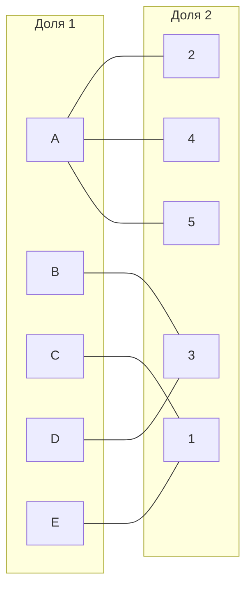
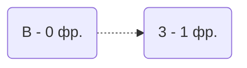
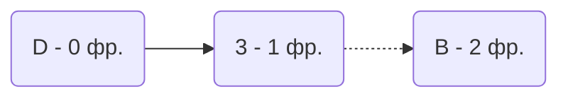
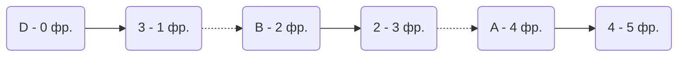
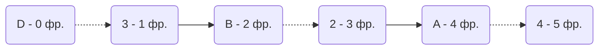
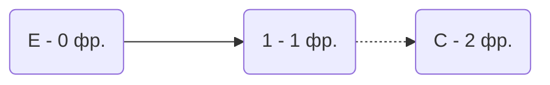
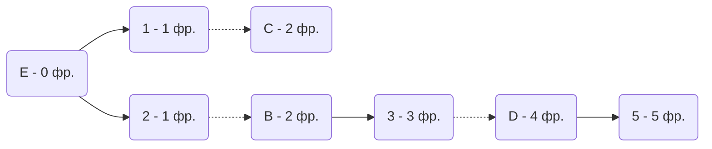
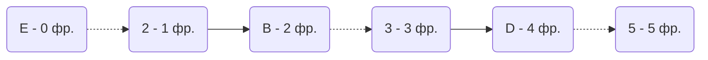

# Задание №8. Задача о назначениях. Венгерский алгоритм.
## Вариант 9
Исходная матрица затрат для A, B, C, D, E и исполнителей 1, 2, 3, 4, 5:

|     | 1  | 2  | 3  | 4  | 5  |
|-----|----|----|----|----|----| 
| A   | 15 | 12 | 14 | 10 | 12 |
| B   | 19 | 11 | 7  | 19 | 16 |
| C   | 6  | 14 | 9  | 19 | 20 |
| D   | 12 | 13 | 9  | 19 | 13 |
| E   | 10 | 14 | 11 | 15 | 18 |

**Шаг 1.** Проведем редукцию матрицы затрат.   
  Вычтем из каждой строки минимальное значение, представленное в этой строке.

  |     | 1  | 2  | 3  | 4  | 5  | min |
  |-----|----|----|----|----|----|-----| 
  | A   | 5  | 2  | 4  | 0  | 2  | 10  |
  | B   | 12 | 4  | 0  | 12 | 9  | 7   |
  | C   | 0  | 8  | 3  | 13 | 14 | 6   |
  | D   | 3  | 4  | 0  | 10 | 4  | 9   |
  | E   | 0  | 4  | 1  | 5  | 8  | 10  |
  
  После чего вычтем из каждого столбца минимальное значение, представленное в этом столбце.

  |     | 1  | 2  | 3  | 4  | 5  | min |
  |-----|----|----|----|----|----|-----| 
  | A   | 5  | 0  | 4  | 0  | 0  | 10  |
  | B   | 12 | 2  | 0  | 12 | 7  | 7   |
  | C   | 0  | 6  | 3  | 13 | 12 | 6   |
  | D   | 3  | 2  | 0  | 10 | 2  | 9   |
  | E   | 0  | 2  | 1  | 5  | 6  | 10  |
  | min | 0  | 2  | 0  | 0  | 2  |     |

 Получим редуцированную матрицу, где нули обозначают наименее затратные варианты назначений.

  |     | 1  | 2  | 3  | 4  | 5  |
  |-----|----|----|----|----|----| 
  | A   | 5  | 0  | 4  | 0  | 0  |
  | B   | 12 | 2  | 0  | 12 | 7  |
  | C   | 0  | 6  | 3  | 13 | 12 |
  | D   | 3  | 2  | 0  | 10 | 2  |
  | E   | 0  | 2  | 1  | 5  | 6  |


**Шаг 2.** Построим двудольный граф, вынесем на него те ребра, для которых в редуцированной матрице указаны нули.



  Выберем любое паросочетание [C, 1], [A, 2] и попытаемся построить совершенное паросочетание с помощью чередующихся деревьев.
  
  ```mermaid
graph LR
    subgraph "Доля 1"
        A[A]
        B[B]
        C[C]
        D[D]
        E[E]
    end
    subgraph "Доля 2"
        1[1]
        2[2]
        3[3]
        4[4]
        5[5]
    end
    A -.- 2
    A --- 4
    A --- 5
    E --- 1
    C -.- 1
    D --- 3
    B --- 3
```

  Запускаем волновой метод. Строим чередующиеся дерево из вершины B
  


  В построенном дереве есть цепь, чередующихся относительно текущего паросочетания, перекрашиваем ребро.
  Получаем:
  
    ```mermaid
graph LR
    subgraph "Доля 1"
        A[A]
        B[B]
        C[C]
        D[D]
        E[E]
    end
    subgraph "Доля 2"
        1[1]
        2[2]
        3[3]
        4[4]
        5[5]
    end
    A -.- 2
    A --- 4
    A --- 5
    E --- 1
    C -.- 1
    D --- 3
    B -.- 3
```

Текущее паросочетание [C, 1], [A, 2], [B, 3]. Запускаем волновой метод.



  В построенном дереве нет цепей, чередующихся относительно текущего паросочетания, то есть в указанном графе нет совершенного паросочетания.

  
**Шаг 3.** Диагональная редукция.
  Во множество X выпишем все покрытые построенным деревом вершины первой доли графа, во множество Y все покрытые построенным деревом вершины из второй доли графа.

  $$ X = {B, D} $$

  $$ Y = {3} $$
 Разделим на 4 сектора по столбцам B, D и строке 3. Получим:

  |     |**3**  | 1  | 2  | 4  | 5  |
  |-----|----|----|----|----|----| 
  | **B** | 0  | 12 | 2  | 12 | 7  |
  | **D** | 0  | 3  | 2  | 10 | 2  |
  | A | 4  | 5  | 0  | 0  | 0  |
  | C | 3  | 0  | 6  | 13 | 12 |
  | E | 1  | 0  | 2  | 5  | 6  |
  
 Необходимо найти минимальный элемент из строк, включенных во множество X и столбцов, не включенных во множество Y.
 
 В нашем случае, это будут строки: A, C, E и столбцы: 1, 2, 4, 5. Минимальный элемент 2, расположен в строках B, D и столбцах 2, 5.
 
 Вычтем найденное значение из строк множества X и прибавим к столбцам множества Y. Новая полученная матрица затрат:
 
  |     |**3**  | 1  | 2  | 4  | 5  |
  |-----|----|----|----|----|----| 
  | **B** | 0  | 10 | 0  | 10 | 5  |
  | **D** | 0  | 1  | 0  | 8  | 0  |
  | A | 6  | 5  | 0  | 0  | 0  |
  | C | 5  | 0  | 6  | 13 | 12 |
  | E | 3  | 0  | 2  | 5  | 6  |

  В ячейках B2, D2, D5 появились новые нулевые значения, добавим соответствующее ребра в двудольный граф.
  
  Получим:

    ```mermaid
graph LR
    subgraph "Доля 1"
        A[A]
        B[B]
        C[C]
        D[D]
        E[E]
    end
    subgraph "Доля 2"
        1[1]
        2[2]
        3[3]
        4[4]
        5[5]
    end
    A -.- 2
    A --- 4
    A --- 5
    B --- 2
    B -.- 3
    E --- 1
    C -.- 1
    D --- 3
    D --- 2
    D --- 5
```  

**Шаг 4.** Попытаемся построить совершенное паросочетание с помощью чередующихся деревьев на основе обновленного графа.

  Запускаем волновой метод



Построенное дерево содержит чередующуюся, относительно текущего паросочетания, цепь D3 - 3B - B2 - 2A - A4, цепь начинается и заканчивается в непокрытых вершинах, все ребра в цепи чередуются по вхождению в текущее паросочетание.

"Перекрасим" найденную цепь и проверим полученное паросочетание.




    ```mermaid
graph LR
    subgraph "Доля 1"
        A[A]
        B[B]
        C[C]
        D[D]
        E[E]
    end
    subgraph "Доля 2"
        1[1]
        2[2]
        3[3]
        4[4]
        5[5]
    end
    A --- 2
    A -.- 4
    A --- 5
    B -.- 2
    B --- 3
    E --- 1
    C -.- 1
    D -.- 3
    D --- 2
    D --- 5
```


  Текущее паросочетание [C, 1], [B, 2], [D, 3], [A, 4]

  Запускаем волновой метод:




В построенном дереве нет цепей, чередующихся относительно текущего паросочетания, то есть в указанном графе нет совершенного паросочетания.

**Шаг 5.** Диагональная редукция.
  
  Во множество X выпишем все покрытые построенным деревом вершины первой доли графа, во множество Y все покрытые построенным деревом вершины из второй доли графа.

  $$ X = {E, C} $$

  $$ Y = {1} $$

 Разделим на 4 сектора по столбцам E, C и строке 1. Получим:

  |     |**1**  | 2  | 3  | 4  | 5  |
  |-----|----|----|----|----|----| 
  | **C** | 0  | 6  | 5  | 13 | 12 |
  | **E** | 0  | 2  | 3  | 5 | 6  |
  | A | 5  | 0  | 6  | 0  | 0  |
  | B | 10 | 0  | 0  | 10 | 5  |
  | D | 1  | 0  | 0  | 8  | 0  |
  
 Необходимо найти минимальный элемент из строк, включенных во множество X и столбцов, не включенных во множество Y.
 
 В нашем случае, это будут строки: A, B, D и столбцы: 2, 3, 4, 5. Минимальный элемент 2, расположен в строке E и столбце 2.
 
 Вычтем найденное значение из строк множества X и прибавим к столбцам множества Y. Новая полученная матрица затрат:
 
  |     |**1**  | 2  | 3  | 4  | 5  |
  |-----|----|----|----|----|----| 
  | **C** | 0  | 4  | 3  | 11 | 10 |
  | **E** | 0  | 0  | 1  | 3 | 4  |
  | A | 7  | 0  | 6  | 0  | 0  |
  | B | 12 | 0  | 0  | 10 | 5  |
  | D | 3  | 0  | 0  | 8  | 0  |

  В ячейке E2 появилось новое нулевое значение, добавим соответствующее ребро в двудольный граф.
  
  Получим:

    ```mermaid
graph LR
    subgraph "Доля 1"
        A[A]
        B[B]
        C[C]
        D[D]
        E[E]
    end
    subgraph "Доля 2"
        1[1]
        2[2]
        3[3]
        4[4]
        5[5]
    end
    A -.- 2
    A --- 4
    A --- 5
    B --- 2
    B -.- 3
    E --- 1
    E --- 2
    C -.- 1
    D --- 3
    D --- 2
    D --- 5
```  

**Шаг 6.** Попытаемся построить совершенное паросочетание с помощью чередующихся деревьев на основе обновленного графа.

  Запускаем волновой метод




Построенное дерево содержит чередующуюся, относительно текущего паросочетания, цепь E2 - 2B - B3 - 3D - D5, цепь начинается и заканчивается в непокрытых вершинах, все ребра в цепи чередуются по вхождению в текущее паросочетание.

"Перекрасим" найденную цепь и проверим полученное паросочетание.





    ```mermaid
graph LR
    subgraph "Доля 1"
        A[A]
        B[B]
        C[C]
        D[D]
        E[E]
    end
    subgraph "Доля 2"
        1[1]
        2[2]
        3[3]
        4[4]
        5[5]
    end
    A --- 2
    A -.- 4
    A --- 5
    B --- 2
    B -.- 3
    E --- 1
    E -.- 2
    C -.- 1
    D --- 3
    D --- 2
    D -.- 5
```


  Текущее паросочетание [C, 1], [E, 2], [B, 3], [A, 4], [D, 5]
  Запускаем волновой метод:


Полученное расписание является совершенным. Выпишем полученные назначения и их стоимости из исходной матрицы:
- A4 - 10;
- B3 - 7;
- C1 - 6;
- D5 - 13;
- E2 - 14.

Общая стоимость затрат = 10 + 7 + 6 + 13 + 14 = 50.

***ОТВЕТ***

Минимальная стоимость затрат 50, при следующих назначениях:

- задача C, исполнитель 1;
- задача E, исполнитель 2;
- задача B, исполнитель 3;
- задача A, исполнитель 4;
- задача D, исполнитель 5.
