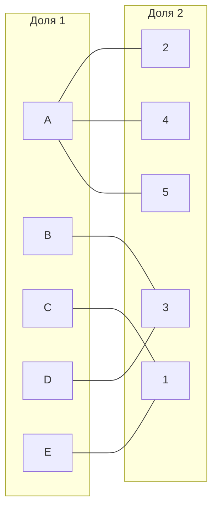

#Задание №8. Задача о назначениях. Венгерский алгоритм.
## Вариант 9
Исходная матрица затрат для A, B, C, D, E и исполнителей 1, 2, 3, 4, 5:

|     | 1  | 2  | 3  | 4  | 5  |
|-----|----|----|----|----|----| 
| A   | 15 | 12 | 14 | 10 | 12 |
| B   | 19 | 11 | 7  | 19 | 16 |
| C   | 6  | 14 | 9  | 19 | 20 |
| D   | 12 | 13 | 9  | 19 | 13 |
| E   | 10 | 14 | 11 | 15 | 18 |

**Шаг 1.** Проведем редукцию матрицы затрат.   
  Вычтем из каждой строки минимальное значение, представленное в этой строке.

  |     | 1  | 2  | 3  | 4  | 5  | min |
  |-----|----|----|----|----|----|-----| 
  | A   | 5  | 2  | 4  | 0  | 2  | 10  |
  | B   | 12 | 4  | 0  | 12 | 9  | 7   |
  | C   | 0  | 8  | 3  | 13 | 14 | 6   |
  | D   | 3  | 4  | 0  | 10 | 4  | 9   |
  | E   | 0  | 4  | 1  | 5  | 8  | 10  |
  
  После чего вычтем из каждого столбца минимальное значение, представленное в этом столбце.

  |     | 1  | 2  | 3  | 4  | 5  | min |
  |-----|----|----|----|----|----|-----| 
  | A   | 5  | 0  | 4  | 0  | 0  | 10  |
  | B   | 12 | 2  | 0  | 12 | 7  | 7   |
  | C   | 0  | 6  | 3  | 13 | 12 | 6   |
  | D   | 3  | 2  | 0  | 10 | 2  | 9   |
  | E   | 0  | 2  | 1  | 5  | 6  | 10  |
  | min | 0  | 2  | 0  | 0  | 2  |     |

 Получим редуцированную матрицу, где нули обозначают наименее затратные варианты назначений.

  |     | 1  | 2  | 3  | 4  | 5  |
  |-----|----|----|----|----|----| 
  | A   | 5  | 0  | 4  | 0  | 0  |
  | B   | 12 | 2  | 0  | 12 | 7  |
  | C   | 0  | 6  | 3  | 13 | 12 |
  | D   | 3  | 2  | 0  | 10 | 2  |
  | E   | 0  | 2  | 1  | 5  | 6  |

**Шаг 2.** Построим двудольный граф, вынесем на него те ребра, для которых в редуцированной матрице указаны нули.
  Выберем любое паросочетание [C, 1], [A, 2] и попытаемся построить совершенное паросочетание с помощью чередующихся деревьев.

