## Вариант 1.

Исходная матрица:

|   | 1  | 2  | 3  | 4  | 5  |
|---|----|----|----|----|----|
| A | 9  | 7  | 16 | 9  | 12 |
| B | 14 | 15 | 10 | 14 | 7  |
| C | 18 | 18 | 10 | 18 | 10 |
| D | 10 | 10 | 14 | 10 | 19 |
| E | 11 | 6  | 5  | 8  | 9  |

## (1) Выполним редукцию матрицы по строкам и столбцам:

Исходная матрица:

|   | 1  | 2  | 3  | 4  | 5  |
|---|----|----|----|----|----|
| A | 9  | 7  | 16 | 9  | 12 |
| B | 14 | 5  | 10 | 14 | 7  |
| C | 11 | 18 | 18 | 10 | 10 |
| D | 10 | 5  | 10 | 14 | 19 |
| E | 11 | 6  | 5  | 8  | 9  |

Минимальное значение для каждой строки:

A - 8
B - 5
C - 10
D - 5
E - 5

Выполняем редукцию матрицы по строкам:

|   | 1  | 2  | 3  | 4  | 5  |
|---|----|----|----|----|----|
| A | 2  | 0  | 9  | 2  | 5  |
| B | 9  | 0  | 5  | 9  | 2  |
| C | 1  | 8  | 8  | 0  | 0  |
| D | 5  | 0  | 5  | 9  | 14 |
| E | 6  | 1  | 0  | 3  | 4  |

Выполняем редукцию матрицы по столбцам:

|   | 1  | 2  | 3  | 4  | 5  |
|---|----|----|----|----|----|
| A | 1  | 0  | 9  | 2  | 5  |
| B | 8  | 0  | 5  | 9  | 2  |
| C | 0  | 8  | 8  | 0  | 0  |
| D | 4  | 0  | 5  | 9  | 14 |
| E | 5  | 1  | 0  | 3  | 4  |

## (2) Построить двудольный граф по основе редуцированной матрицы:

Берём только те паросочетания, в пересечении вершин котрых в таблице стоит "0".

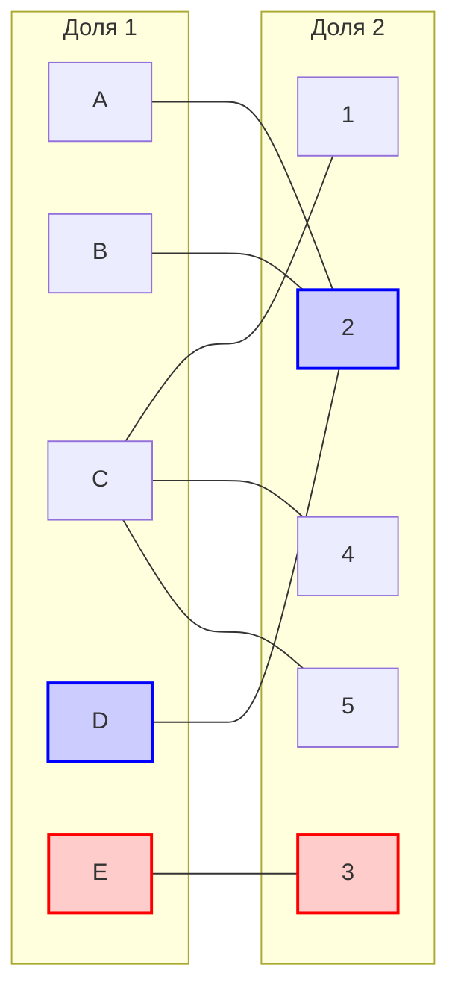

Совершенного парасочетания нет, следовательно применяем волновой метод

## (3) Найти совершенное парасочетание.

Пусть начальные парасочетания [D, 2] и [E, 3]

Волновой метод:

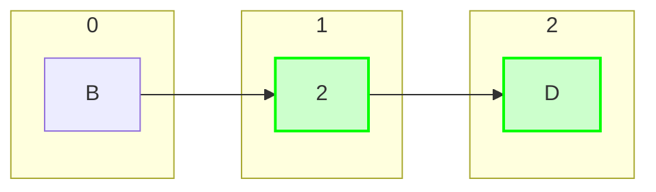

Построение чередующегося дерева завершилось, так как третий фронт пуст.

Так как в этом древе нет чередующейся цепи, то применим к матрице диагональную редукцию:

B и D строчку и второй столбец делим:

|   | 1  | 2  | 3  | 4  | 5  |
|---|----|----|----|----|----|
| A | 1  | 0  | 9  | 2  | 5  |
| B | 8  | 0  | 5  | 9  | 2  |
| C | 0  | 8  | 8  | 0  | 0  |
| D | 4  | 0  | 5  | 9  | 14 |
| E | 5  | 1  | 0  | 3  | 4  |  

Применяем для удобства строчки и столбцы местами:

|   | 2  | -  | 1  | 3  | 4  | 5  |
|---|----|----|----|----|----|----|
| B | 0  | -  | 8  | 5  | 9  | 2  |
| D | 0  | -  | 4  | 5  | 9  | 14 |
| - | -  | -  | -  | -  | -  | -  |
| A | 0  | -  | 1  | 9  | 2  | 5  |
| C | 8  | -  | 0  | 8  | 0  | 0  |
| E | 1  | -  | 5  | 0  | 3  | 4  |

Вычтим 2 из строчек "B" и "D" в столбцах "1", "3", "4" и "5"

Прибавим 2 к столбцу "2" в строчки "A", "C" и "E"

В результате получаем следующую матрицу:

|   | 2  | 1  | 3  | 4  | 5  |
|---|----|----|----|----|----|
| B | 0  | 6  | 3  | 7  | 0  |
| D | 0  | 2  | 3  | 7  | 12 |
| A | 2  | 1  | 9  | 2  | 5  |
| C | 10 | 0  | 8  | 0  | 0  |
| E | 3  | 5  | 0  | 3  | 4  |

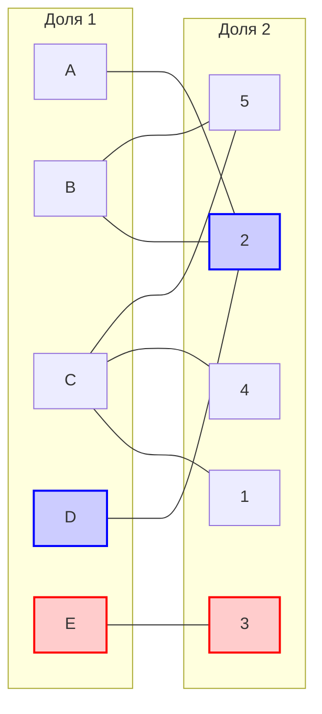

Волновой метод:

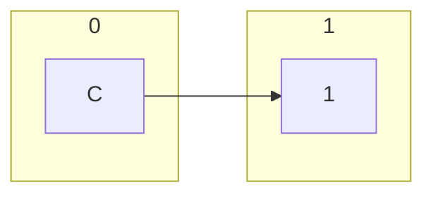

Завершаем, поскольку чередующаяся цепь найдена.

Перекрашиваем и получаем новые парасочетания [C, 1], [D, 2], [E, 3]

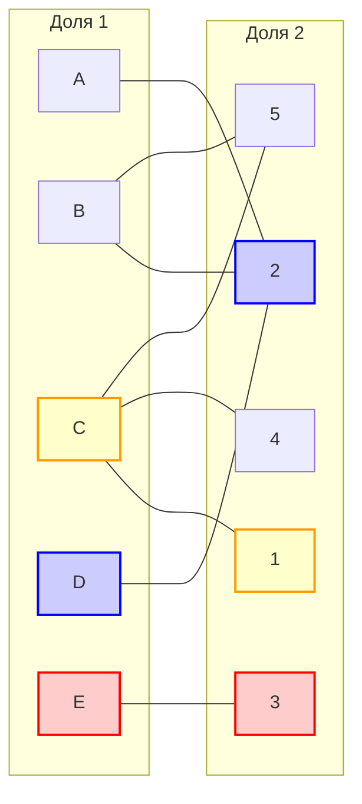

Волновой метод:

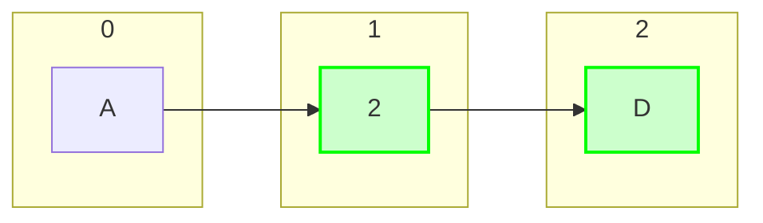

Завершаем, так как третий фронт пуст.

Снова выполняем диагональную редукцию в строках A, D и в столбце 2 будем делать доли

|   | 2  | -  | 1  | 3  | 4  | 5  |
|---|----|----|----|----|----|----|
| A | 2  | -  | 1  | 9  | 2  | 5  |
| D | 0  | -  | 2  | 3  | 7  | 12 |
| - | -  | -  | -  | -  | -  | -  |
| B | 0  | -  | 6  | 3  | 7  | 0  |
| C | 10 | -  | 0  | 8  | 0  | 0  |
| E | 3  | -  | 5  | 0  | 3  | 4  |

Вычтим 1 из строчек "A" и "D" в столбцах "1", "3", "4" и "5"

Прибавим 1 к столбцу "2" в строчки "B", "C" и "E"

В результате получаем следующую матрицу:

|   | 2  | 1  | 3  | 4  | 5  |
|---|----|----|----|----|----|
| A | 2  | 0  | 8  | 1  | 4  |
| D | 0  | 1  | 2  | 6  | 11 |
| B | 1  | 6  | 3  | 7  | 0  |
| C | 11 | 0  | 8  | 0  | 0  |
| E | 4  | 5  | 0  | 3  | 4  |

Получили такой граф (добавилось ребро [A, 1])

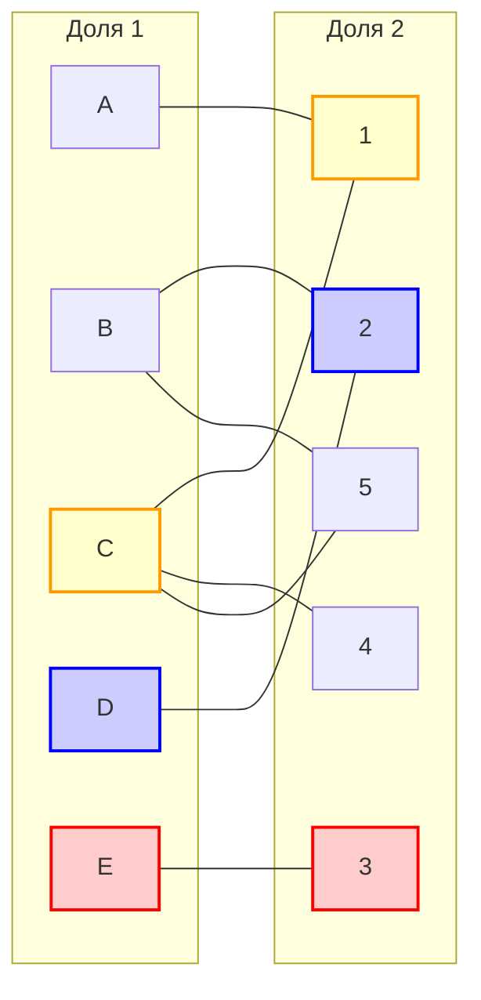

Волновой метод:

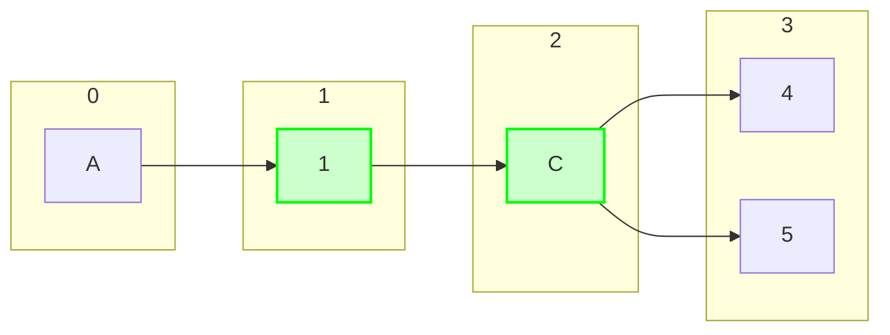

Завершам дерево, так как цепь найдена.

Инвартируем цепь

(Возьмём конец {5})

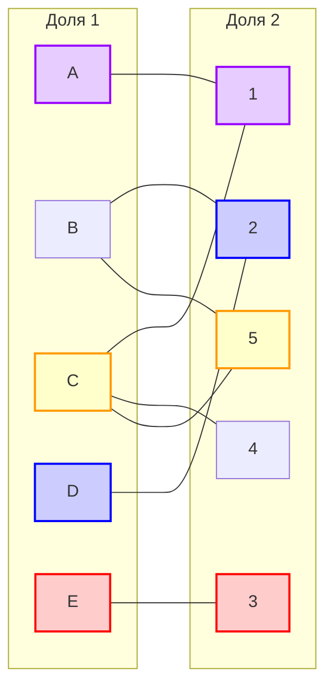

Волновой метод:

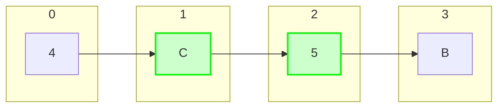

Завершаем дерево, так как в нём есть чередуцющаяся цепь.

Инвертируем цепь.

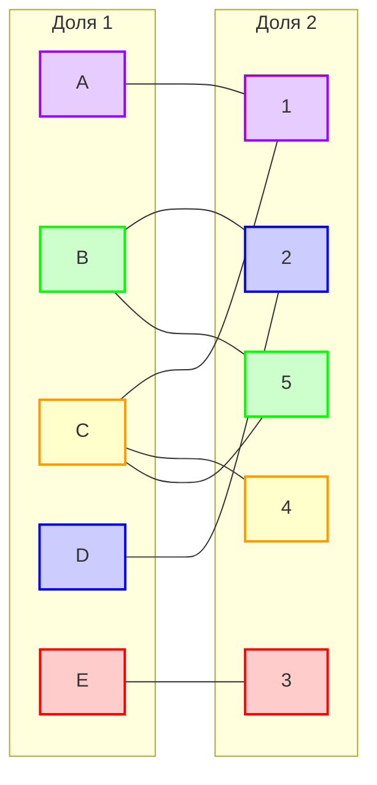

Получаем совершенные паросочетания:

[A, 1], [B, 5], [C, 4], [D, 2], [E, 3]\
&nbsp; &nbsp; 9 &nbsp; &nbsp; &nbsp; 7 &nbsp; &nbsp; &nbsp;  10 &nbsp; &nbsp; &nbsp; 5 &nbsp; &nbsp; &nbsp; &nbsp;5

## Ответ: 9 + 7 + 10 + 5 + 5 = 36
