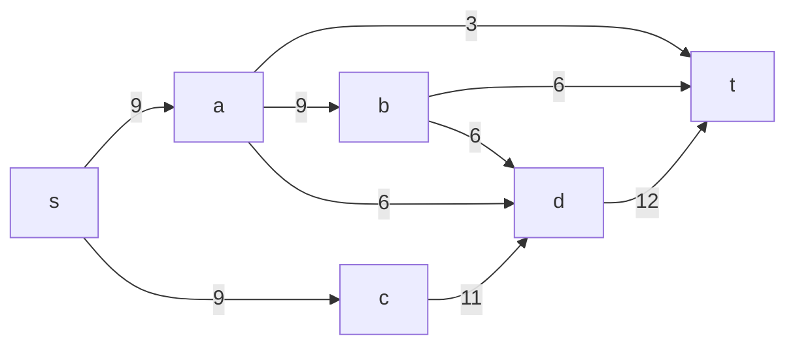
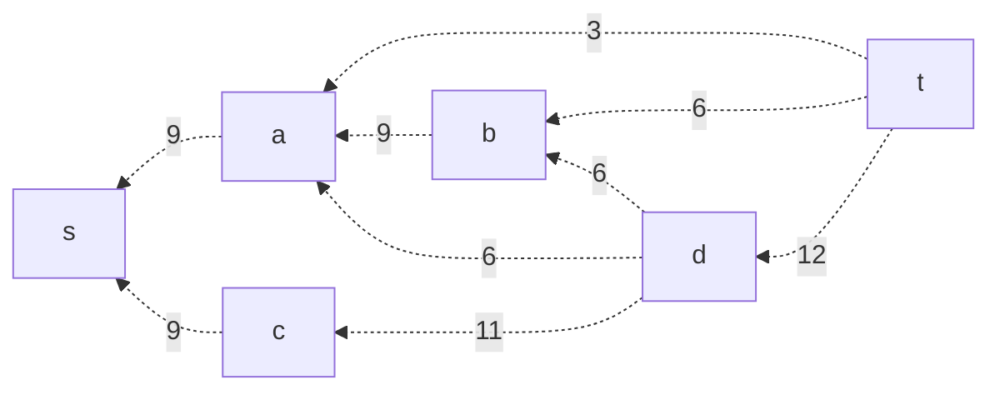
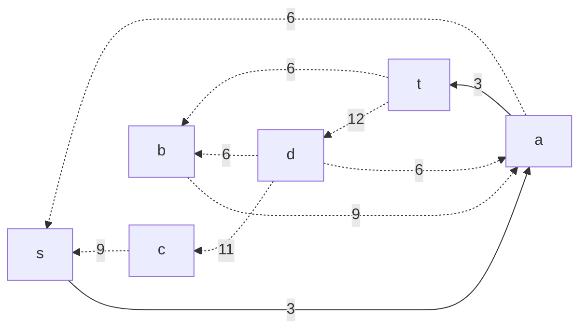
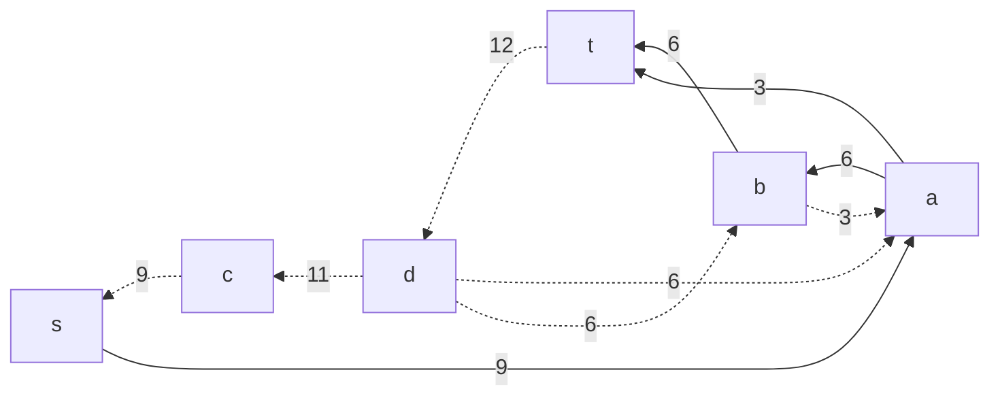
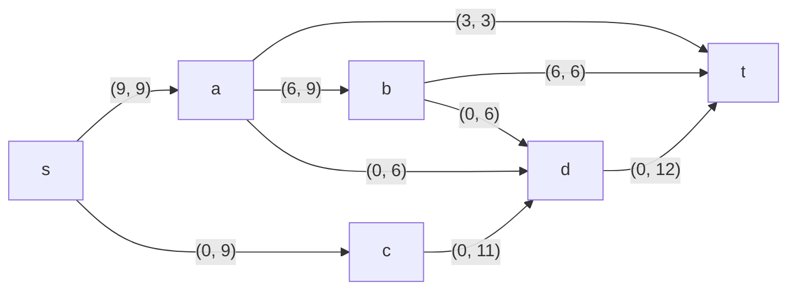
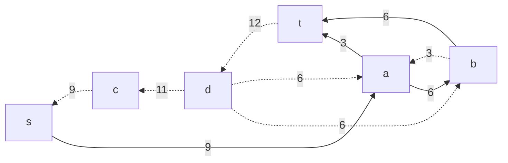
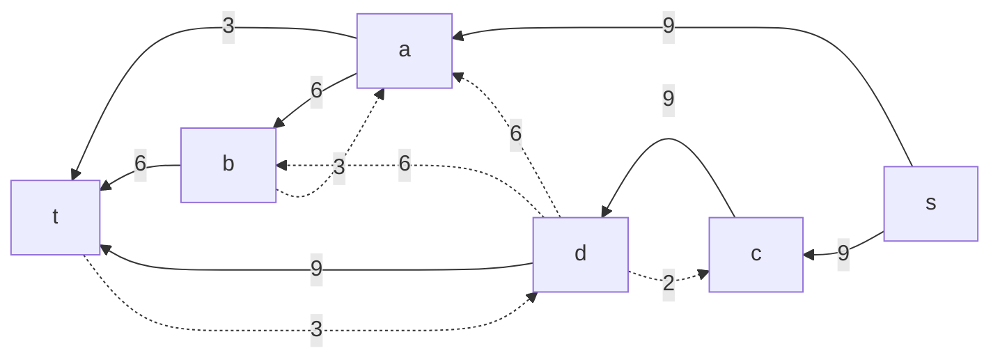
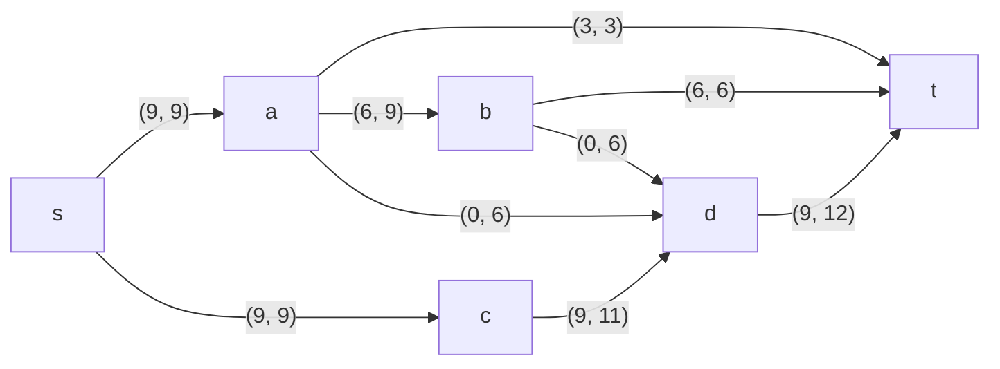

# Задача о максимальном потоке
***Вариант 5***

Пропускная способность дуг сети в таблице

|          Дуги          | sa | sc | at | ab | ad | cd | bd | bt | dt |
|:----------------------:|:--:|:--:|:--:|:--:|:--:|:--:|:--:|:--:|:--:|
| Пропускная способность |  9 |  9 | 3  | 9  | 6  | 11 | 6  | 6  | 12 |

***1. Построим сеть с источником s, стоком t и указанными пропускными способностями дуг***



**Построим остаточную сеть. Так как изначально поток в сети не задан, все дуги сети являются пустыми (локальный поток равен нулю), соответственно в остаточную сеть необходимо вынести обратную дугу с весом равным пропускной способности.**

***Остаточная сеть:***



***2. Проведем поиск увеличивающего пути в остаточной сети***

В остаточной сети найден увеличивающий путь  t -> a -> s. Минимальный вес дуг на этом пути равен 3.

Уменьшим вес дуг на найденном пути, дуги для которых вес стал нулевым удалим из остаточной сети.



Скорректируем соответствующим образом локальные потоки в исходной сети. Первым числом будем указывать локальный поток, вторым пропускную способность дуги.


***3. Продолжаем поиск увеличивающего пути в остаточной сети***


В остаточной сети найден увеличивающий путь t -> b -> a -> s.
Минимальный вес дуг на этом пути равен 6.

Уменьшим вес дуг на найденном пути, дуги для которых вес стал нулевым удалим из остаточной сети.



Скорректируем соответствующим образом локальные потоки в исходной сети.



***4. Продолжим поиск увеличивающего пути в остаточной сети***



В остаточной сети найден увеличивающий путь t -> d -> c -> s. Минимальный вес дуг на этом пути равен 9.

Уменьшим вес дуг на найденном пути, дуги для которых вес стал нулевым удалим из остаточной сети.


Скорректируем соответствующим образом локальные потоки в исходной сети.



***5. Продолжим поиск увеличивающего пути в остаточной сети***

В остаточной сети не найдено увеличивающих путей, следовательно, алгоритм завершил работу и найденный поток величиной 18 является максимальным для данной сети.

***6. Проверим значение максимального потока перебором всех разрезов сети***

Пропускная способность разреза - сумма пропускной способности дуг, начинающихся в вершинах из множества V1 и оканчивающихся в вершинах из V2.

Для сети из n вершин существует 2n - 2 различных разрезов, так как две вершины из множества (источник и сток) "зафиксированы" в V1 и V2, остальные вершины можно различными способами распределять между множествами V1 и V2.

Для сети из 6 вершин нужно найти 2 <sup>6 - 2</sup> = 2<sup>4</sup> = 16 разрезов.

| № | V<sub>1</sub>                   | V<sub>2</sub> | Пропускная способность разреза |
|---|:--------------------------------|:--------------|:------------------------------:|
| 1 | s                               | a, b, c, d, t    |           9 + 9 = 18           |
|   | **s + одна вершина из a, b, c, d** |               |                                |
| 2 | s, a                            | b, c, d, t       |         9 + 6 + 9 + 3 = 27     |
| 3 | s, b                            | a, c, d, t       |         9 + 9 + 6 + 6 = 30     |
| 4 | s, c                            | a, b, d, t       |         9 + 11 = 20            |
| 5 | s, d                            | a, b, c, t       |         9 + 9 + 12 = 30        |
|   | **s + пара вершин из a, b, c, d**  |               |                                |
| 6 | s, a, b                         | c, d, t          |         9 + 3 + 6 + 6 + 6 = 30 |
| 7 | s, a, c                         | b, d, t          |         3 + 9 + 6 + 11 = 29    |
| 8 | s, a, d                         | c, b t           |         9 + 9 + 3 + 12 = 33    |
| 9 | s, b, c                         | a, d, t          |         9 + 6 + 6 + 11 = 32    |
| 10 | s, b, d                        | a, c, t          |         9 + 9 + 6 + 12 = 36    |
| 11 | s, c, d                        | a, b, t          |         9 + 12 = 21            |
|   | **s + три вершины из a, b, c, d**  |               |                                |
| 12 | s, a, b, c                        | d, t          |         6 + 3 + 6 + 6 + 11 = 32|
| 13 | s, a, b, d                         | c, t         |        9 + 3 + 6 + 12 = 30     |
| 14 | s, c, b, d                         | a, t         |        9 + 6 + 12 = 27         | 
| 15 | s, a, c, d                         | b, t         |        9 + 3 + 12 = 24         |
|   | **s + четыре вершины из a, b, c, d**  |            |                                |
| 16 | s, a, b, c, d                    | t              |           3 + 6 + 12 = 21      |


Минимальная пропускная способность разреза равна 18 ( {s} / {a, b, c, d, t} ), что совпадает с найденной величиной максимального потока в сети.

## Ответ
 Максимальный поток в сети равен 18, он реализуется следующими локальными потоками:

 ```mermaid
graph LR
    s-->|"(9, 9)"|a
    a-->|"(3, 3)"|t
    s-->|"(9, 9)"|c
    c-->|"(9, 11)"|d
    a-->|"(6, 9)"|b
    a-->|"(0, 6)"|d
    b-->|"(6, 6)"|t
    b-->|"(0, 6)"|d
    d-->|"(9, 12)"|t
```

