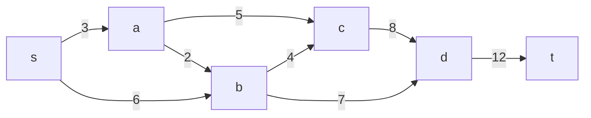
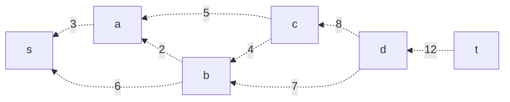
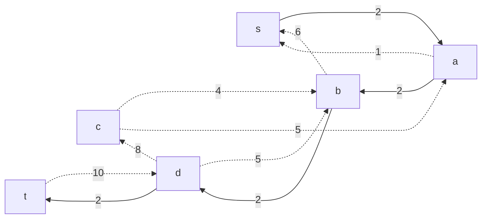
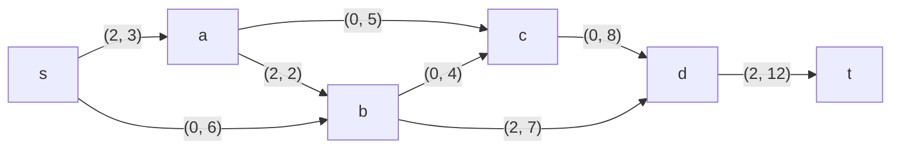
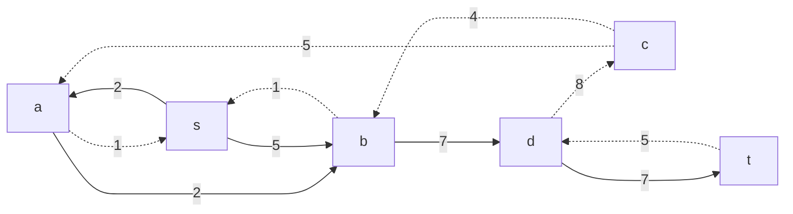
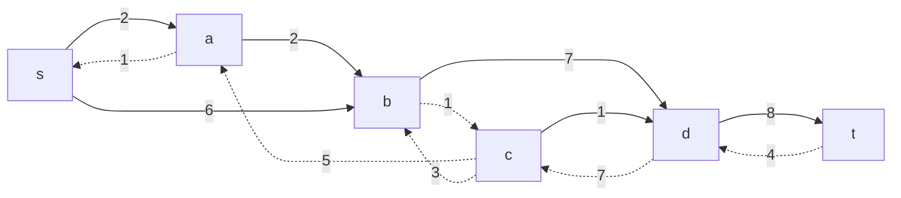
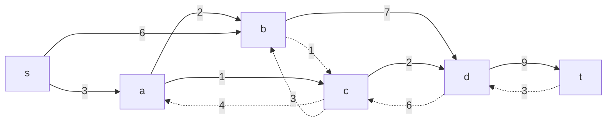
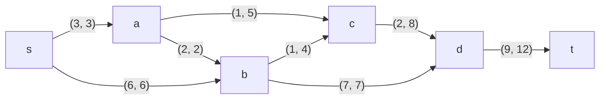

Пропускная способность дуг сети указана в таблице.

|          Дуги          | sa | sb | ac | ab | bc | bd | cd | dt |
|:----------------------:|:--:|:--:|:--:|:--:|:--:|----|----|----|
| Пропускная способность | 3  | 6  | 5  | 2  | 4  | 7  | 8  | 12 |

### 1. Построим сеть с источником **s**, стоком **t** и указанными пропускными способностями дуг.

Построим остаточную сеть. Так как изначально поток в сети не задан, все дуги сети являются пустыми (локальный поток равен нулю), соответственно в остаточную сеть необходимо вынести обратную дугу с весом равным пропускной способности. 

### 2. Проведем поиск увеличивающего пути в остаточной сети
В остаточной сети найден увеличивающий путь t -> d -> b -> a -> s. Минимальный вес дуг на этом пути равен 2.

Уменьшим вес дуг на найденном пути, дуги для которых вес стал нулевым удалим из остаточной сети.

Скорректируем соответствующим образом локальные потоки в исходной сети. Первым числом будем указывать локальный поток, вторым пропускную способность дуги. 

### 3. Продолжим поиск увеличивающего пути в остаточной сети

В остаточной сети найден увеличивающий путь t -> d -> b -> s. Минимальный вес дуг на этом пути равен 5.

Уменьшим вес дуг на найденном пути, дуги для которых вес стал нулевым удалим из остаточной сети.

Скорректируем соответствующим образом локальные потоки в исходной сети.

### 4. Продолжим поиск увеличивающего пути в остаточной сети

В остаточной сети найден увеличивающий путь t -> d -> c -> b -> s. Минимальный вес дуг на этом пути равен 1.

Уменьшим вес дуг на найденном пути, дуги для которых вес стал нулевым удалим из остаточной сети.

Скорректируем соответствующим образом локальные потоки в исходной сети.

### 5. Продолжим поиск увеличивающего пути в остаточной сети

В остаточной сети найден увеличивающий путь t -> d -> c -> a -> s. Минимальный вес дуг на этом пути равен 1.

Уменьшим вес дуг на найденном пути, дуги для которых вес стал нулевым удалим из остаточной сети.

Скорректируем соответствующим образом локальные потоки в исходной сети.

### 6. Продолжим поиск увеличивающего пути в остаточной сети
В остаточной сети не найдено увеличивающих путей, следовательно, алгоритм завершил работу и найденный поток величиной 9 является максимальным для данной сети.

### 7. Проверим значение максимального потока перебором всех разрезов сети.
Разрез сети - разбиение множества вершин на два подмножества V1 и V2, где во множество V1 входит источник, а в V2 входит сток.

Пропускная способность разреза - сумма пропускной способности дуг, начинающихся в вершинах из множества V1 и оканчивающихся в вершинах из V2.

Для сети из _n_ вершин существует 2n - 2 различных разрезов, так как две вершины из множества (источник и сток) "зафиксированы" в V1 и V2, остальные вершины можно различными способами распределять между множествами V1 и V2.

Для сети из 6 вершин нужно найти 26 - 2 = 24 = 16 разрезов. 

| №  | V1                     | V2 | Пропускная способность разреза |
|----|:----------------------------------|:--------------|:------------------------------:|
| 1  | s                                 | a, b, c, d, t |          3 + 6 = 9             |
|    | **s + одна вершина из a, b, c, d**|               |                                |
| 2  | s, a                              | b, c, d, t    |      6 + 5 + 2 = 13            |
| 3  | s, b                              | a, c, d, t    |      3 + 7 + 4 = 14            |
| 4  | s, c                              | a, b, d, t    |      3 + 6 + 8 = 17            |
| 5  | s, d                              | a, b, c, t    |      3 + 6 + 9 = 12            |
|    | **s + пара вершин из a, b, c, d** |               |                                |
| 6  | s, a, b                           | c, d, t       |      5 + 4 + 7 = 16            |
| 7  | s, a, c                           | b, d, t       |      6 + 2 + 8 = 16            |
| 8  | s, a, d                           | b, c, t       |      5 + 2 + 6 + 12 = 25       |
| 9  | s, b, c                           | a, d, t       |      3 + 7 + 8 = 18            |
| 10 | s, b, d                           | a, c, t       |      3 + 4 + 12 = 19           |
| 11 | s, c, d                           | a, b, t       |      3 + 6 + 12 = 21           |
|    | **s + три вершины из a, b, c, d** |               |                                |
| 12 | s, a, b, c                        | d, t          |      8 + 7 = 15                |
| 13 | s, a, b, d                        | c, t          |      4 + 12 + 5 = 21           |
| 14 | s, a, c, d                        | b, t          |      12 + 2 + 6 = 20           |
| 15 | s, b, c, d                        | a, t          |      3 + 12 = 15               |
|    | **s + все четыре вершины**        |               |                                |
| 16 | s, a, b, c, d                     | t             |      12                        |

Минимальная пропускная способность разреза равна 9 ( {s} / {t, a, b, c, d} ), что совпадает с найденной величиной максимального потока в сети.

### Ответ:
Максимальный поток в сети равен 9, он реализуется следующим локальными потоками:

