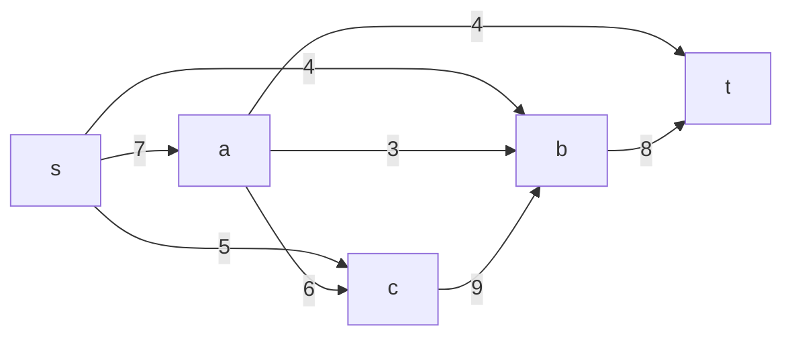
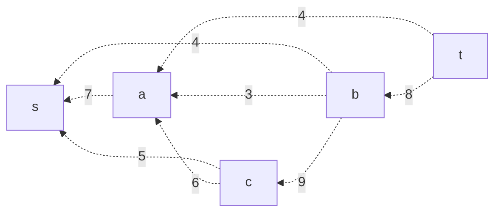
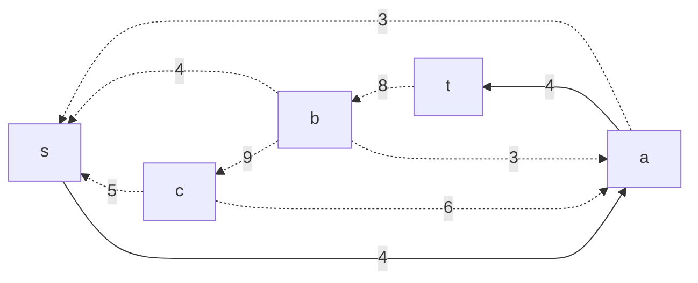
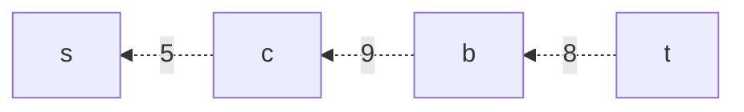
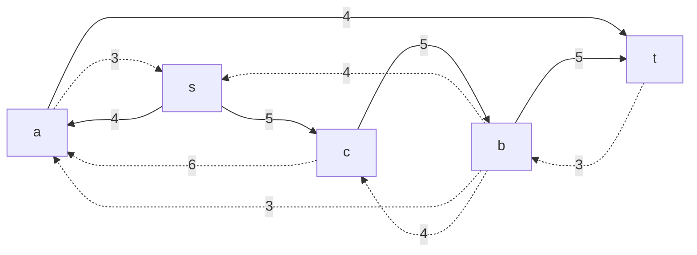
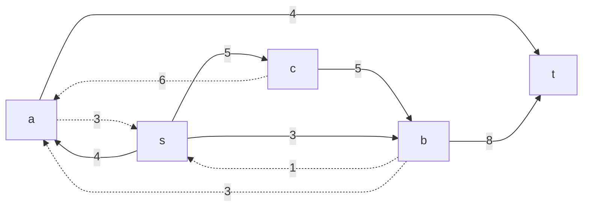
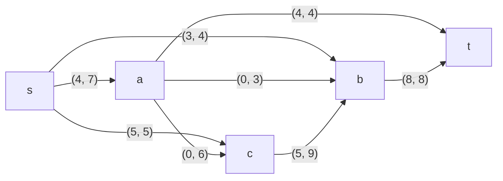

# Задание №9, вариант 8

# Задача о максимальном потоке

## Постановка задачи
1. Дана сеть (взвешенный ориентированный граф) с источником s и стоком t. 
2. Для каждой дуги определена ее пропускная способность:

|          Дуги          | sa | sb | sс | aс | ab | cb | at | bt |
|:----------------------:|:--:|:--:|:--:|:--:|:--:|:--:|:--:|:--:|
| Пропускная способность | 7  | 4  | 5  | 6  | 3  | 9  | 4  | 8  |

3. Необходимо найти максимальный поток для указанной сети. 

## Сеть 

Для начала построим сеть с источником *s* и стоком *t* с указанием пропускной способности дуг. 

## Остаточная сеть

Построим остаточную сеть. Будем считать, что изначально локальный поток равен *0*.

## Определение максимального потока методом поиска увеличивающих путей в остаточной сети.

### 1. 

Найдем увеличивающую цепь в остаточной сети: 

Так как минимальный вес дуг в цепи равен *4*, добавим в остаточную сеть поток с той же мощностью.

Построим новую остаточную сеть:

### 2. 

Найдем следующую увеличивающую цепь в остаточной сети: 

Минимальный вес дуг в цепи равен *5*.

Построим новую остаточную сеть:

### 3. 

Найдем следующую увеличивающую цепь в остаточной сети: 

Минимальный вес дуг в цепи равен *3*.

Построим новую остаточную сеть:

Так как в сети нет ни одного ориентированного пути из *t* в *s*, то добавить новые потоки нельзя.

## Итоговая конфигурация сети

Максимальный поток в сети равен *12*.

## Проверим значение максимального потока перебором всех разрезов сети.

| № | V1                   | V2 | Пропускная способность разреза |
|---|:--------------------------------|:--------------|:------------------------------:|
| 1 | s                               | a, b, c, t    |         7 + 4 + 5 = 16         |
| 2 | s, a                            | b, c, t       |     4 + 3 + 6 + 4 + 5 = 22     |
| 3 | s, b                            | a, c, t       |         7 + 5 + 8 = 20         |
| 4 | s, c                            | a, b, t       |         7 + 4 + 9 = 20         |
| 5 | s, a, b                         | c, t          |       5 + 4 + 6 + 8 = 23       |
| 6 | s, a, c                         | b, t          |       4 + 4 + 3 + 9 = 20       |
| 7 | s, b, c                         | a, t          |           7 + 8 = 15           |
| 8 | s, a, b, c                      | t             |           4 + 8 = 12           |

Минимальная пропускная способность разреза равна 12 ( {s, a, b, c} | {t} ), что совпадает с найденной величиной максимального потока в сети.