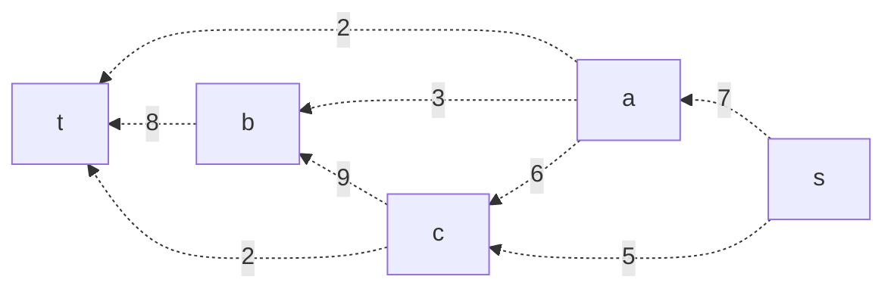
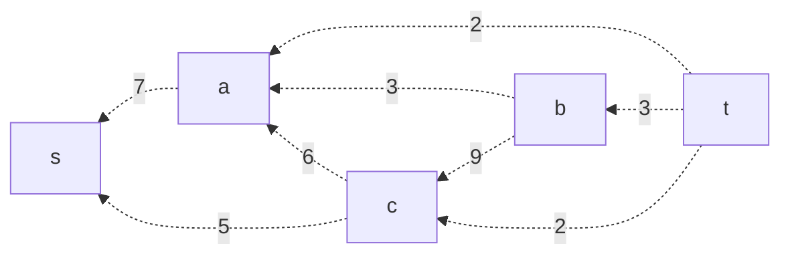
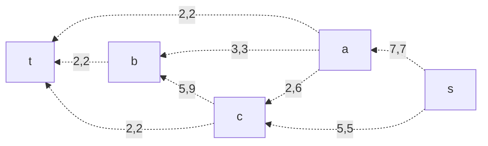

# Задание №9, вариант 4

# Задача о максимальном потоке

#### Пропускная способность дуг сети:

|          Дуги          | sa | sс | aс | ab | cb | at | bt | ct |
|:----------------------:|:--:|:--:|:--:|:--:|:--:|:--:|:--:|:--:|
| Пропускная способность | 7  | 5  | 6  | 3  | 9  | 2  | 8  | 2  |

По данной таблице пропускных способностей дуг можно построить следующую схему:

## 1. Остаточная сеть:

## 2. Найдем увеличение пути по порядку:

 t → a → 3: min 2 (соот. дуги на схеме изм.)
 t → b → a → e: min 3 (соот. дуги на схеме изм.)
 t → c → S: min 2 (соот. дуги на схеме изм.)
 t → b → c → S: min 3 (соот. дуги на схеме изм.)
 t → b → c → a → S: min 2 (соот. дуги на схеме изм.)

## 3. Увеличения путей больше нет. Найдем поток величины 12, макс. поток в сети

## 4. Проверка по закону сохраненного потока

### 4.1. Для источника потока
S = 7 + 5 = 12 = t = 2 + 8 + 2 = 12

### 4.2. Для внутренних узлов

- a: ПРИШЛО 7 = УШЛО (2 + 3 + 2 = 7)
- b: ПРИШЛО (3 + 5 = 8) = УШЛО (8)
- c: ПРИШЛО (2 + 5) = УШЛО (5 + 2 = 7)

Вывод: Проверка доказала корректность проведенной работы. Макс. поток = 12 и представлен в виде схемы выше.

