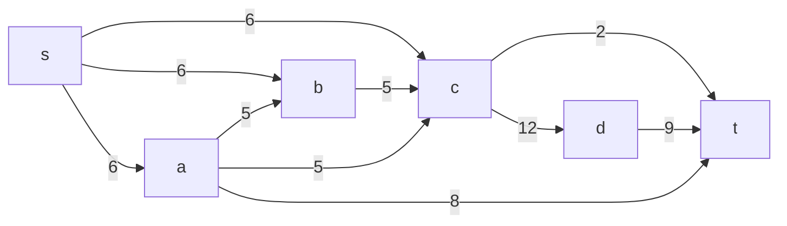
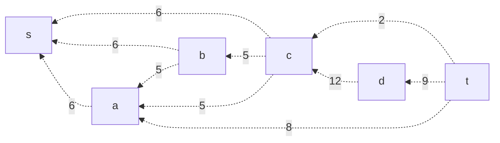
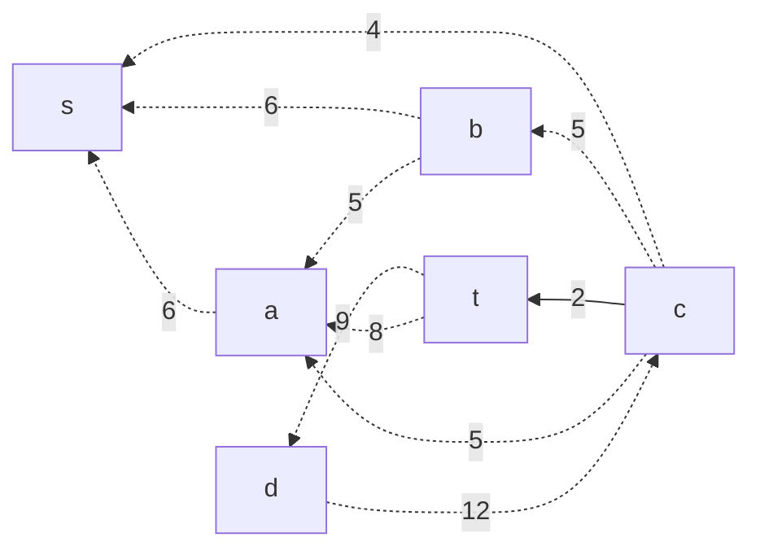
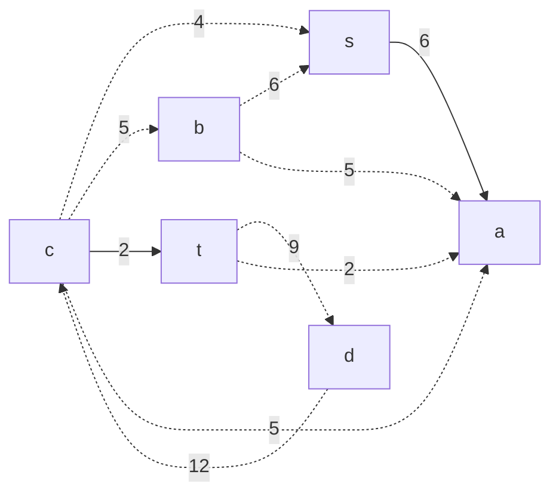
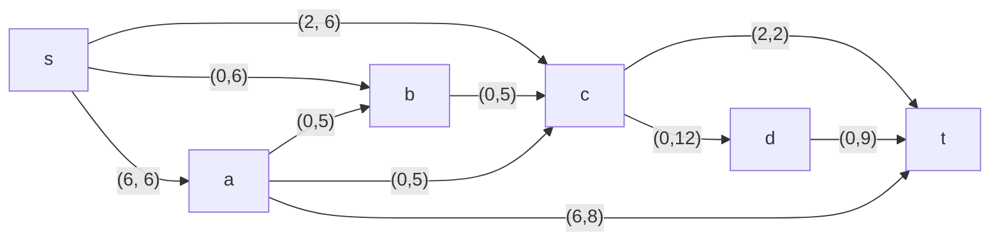
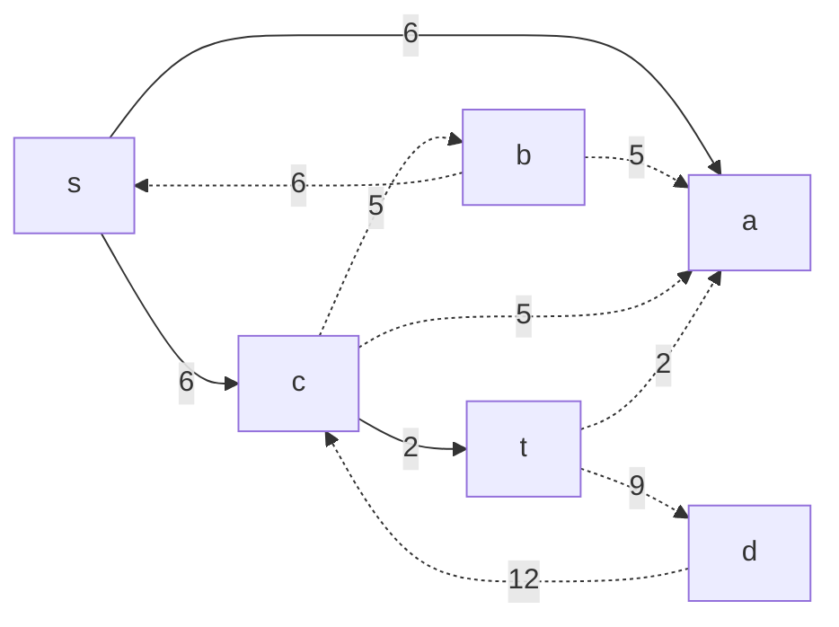
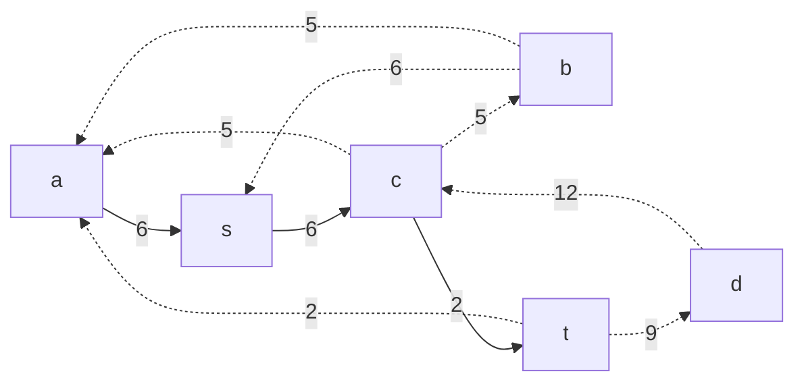
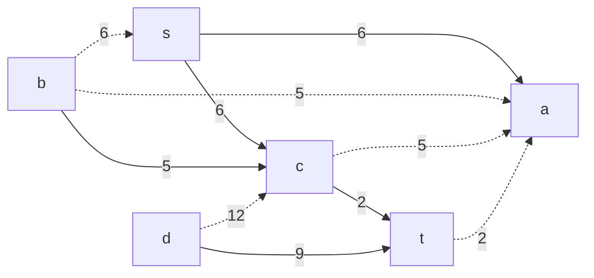

# Задание №9. Задача о максимальном потоке.
## Вариант 2
Пропускная способность дуг сети указана в таблице.

|          Дуги          | sa | sb | sc | ab | bc | cd | ct | dt | ac | at |
|:----------------------:|:--:|:--:|:--:|:--:|:--:|:--:|:--:|:--:|:--:|:--:|
| Пропускная способность | 6  | 6  | 6  | 5  | 5  | 12 | 2  | 9  | 5  | 8  |

### Шаг 1. Построим сеть с источником s, стоком t и указанными пропускными способностями дуг.

Построим остаточную сеть. Так как изначально поток в сети не задан, все дуги сети являются пустыми (локальный поток равен нулю), соответственно в остаточную сеть необходимо вынести обратную дугу с весом равным пропускной способности.

### Шаг 2. Проведем поиск увеличивающего пути в остаточной сети.

В остаточной сети найден увеличивающий путь t -2-> c -6-> s. Минимальный вес дуг на этом пути равен 2.

Уменьшим вес дуг на найденном пути, а дуги для которых вес стал нулевым удалим из остаточной сети. В намеш случае дуга c --> t стала насыщенной, изобразим её прямой дугой.

Скорректируем соответствующим образом локальные потоки в исходной сети. Первым числом будем указывать локальный поток, вторым пропускную способность дуги.

### Шаг 3. Продолжим поиск увеличивающего пути в остаточной сети.

В остаточной сети найден увеличивающий путь t -8-> a -6-> s. Минимальный вес дуг на этом пути равен 6.

Уменьшим вес дуг на найденном пути, дуги для которых вес стал нулевым удалим из остаточной сети. В намеш случае дуга s --> a стала насыщенной, изобразим её прямой дугой.

Скорректируем соответствующим образом локальные потоки в исходной сети.

### Шаг 4. Продолжим поиск увеличивающего пути в остаточной сети.

В остаточной сети найден увеличивающий путь t -9-> d -12 -> c -4-> s. Минимальный вес дуг на этом пути равен 4.

Уменьшим вес дуг на найденном пути, дуги для которых вес стал нулевым удалим из остаточной сети. В намеш случае дуга s --> c стала насыщенной, изобразим её прямой дугой.

Скорректируем соответствующим образом локальные потоки в исходной сети.

### Шаг 5. Продолжим поиск увеличивающего пути в остаточной сети.

В остаточной сети найден увеличивающий путь t -5-> d -8-> c -5-> b -6-> s. Минимальный вес дуг на этом пути равен 5.

Уменьшим вес дуг на найденном пути, дуги для которых вес стал нулевым удалим из остаточной сети. В намеш случае дуги b --> c и d --> t стали насыщенными, изобразим их прямыми дугами.

Скорректируем соответствующим образом локальные потоки в исходной сети.

### Шаг 6. Продолжим поиск увеличивающего пути в остаточной сети.
В остаточной сети больше не найдено увеличивающих путей, а это значит, что алгоритм завершил работу.

Найденный поток величиной 17 является максимальным для данной сети.

### Шаг 7. Проверка.
Разрез сети - разбиение множества вершин на два подмножества V1 и V2, где во множество V1 входит источник, а в V2 входит сток.

Пропускная способность разреза - сумма пропускной способности дуг, начинающихся в вершинах из множества V1 и оканчивающихся в вершинах из V2.

Для сети из _n_ вершин существует 2n - 2 различных разрезов, так как две вершины из множества (источник и сток) "зафиксированы" в V1 и V2, остальные вершины можно различными способами распределять между множествами V1 и V2.

Для сети из 6 вершин нужно найти 26 - 2 = 24 = 16 разрезов. 

| № | V1                   | V2 | Пропускная способность разреза |
|---|:--------------------------------|:--------------|:------------------------------:|
| 1 | s                               | a, b, c, d, t    |      6 + 6 + 6 = 18         |
|   | **s + одна вершина из a, b, c, d**|
| 2 | s, a                            | b, c, d, t       |      6 + 5 + 6 + 5 + 8 = 30 |
| 3 | s, b                            | a, c, d, t       |      6 + 6 + 5 = 17         |
| 4 | s, c                            | a, b, d, t       |      6 + 6 + 12 + 2 = 26    |
| 5 | s, c                            | a, b, d, t       |      6 + 6 + 6 + 9 = 27     |
|   | **s + пара вершин из a, b, c, d**|
| 6 | s, a, b                         | c, d, t          |      6 + 5 + 5 + 8 = 24     |
| 7 | s, a, c                         | b, d, t          |      5 + 12 + 2 + 8 + 6 = 33    |
| 8 | s, a, d                         | b, c, t          |      6 + 6 + 5 + 5 + 9 + 8 = 39     |
| 9 | s, b, c                         | a, d, t          |      6 + 2 + 12 = 20        |
| 10 | s, b, d                        | a, c, t          |      6 + 6 + 5 + 9 = 26         |
| 11 | s, c, d                        | a, b, t          |      6 + 9 + 6 + 2 = 23     |
|   | **s + три вершины из a, b, c**|
| 12 | s, a, b, c                     | d, t             |      12 + 2 + 8 = 22        |
| 13 | s, a, b, d                     | c, t             |      6 + 5 + 5 + 8 + 9 = 33         |
| 14 | s, a, c, d                     | b, t             |      5 + 6 + 2 + 9 + 8 = 30       |
| 15 | s, b, c, d                     | a, t             |      6 + 2 + 9 = 17         |
|   | **s + все 4**  |
| 16 | s, a, b, c, d                  |t                 |      8 + 2 + 9 = 19         |

Минимальная пропускная способность разреза равна 17 ( {s, b} | {a, c, d, t} ), что совпадает с найденной величиной максимального потока в сети.

### Ответ:
Максимальный поток в сети равен 17 (6 + 6 + 5 или 6 + 9 + 2), он реализуется следующими образом:

