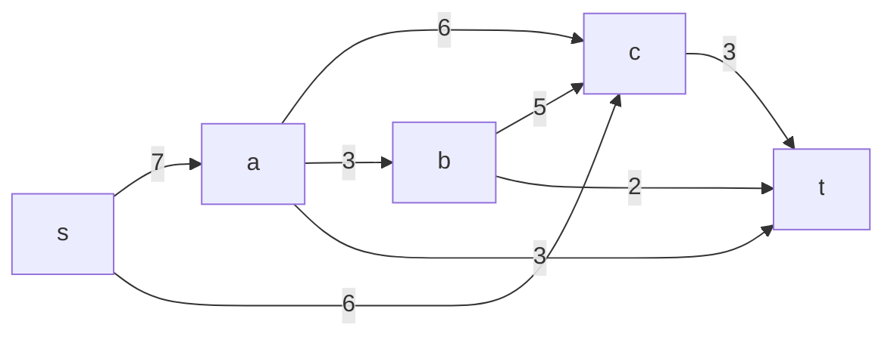
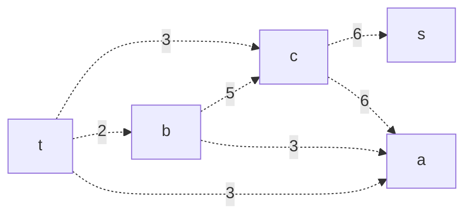
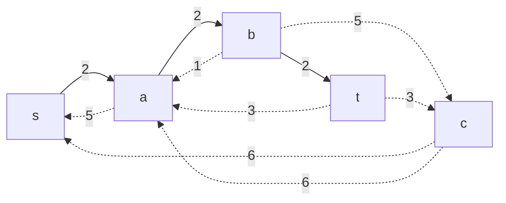
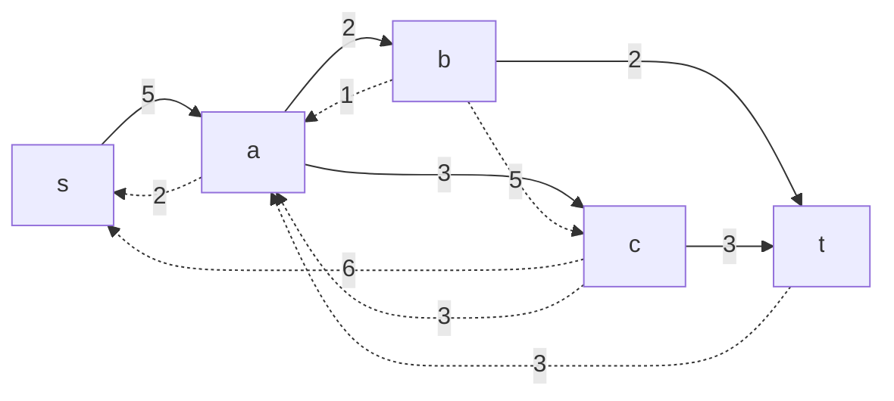
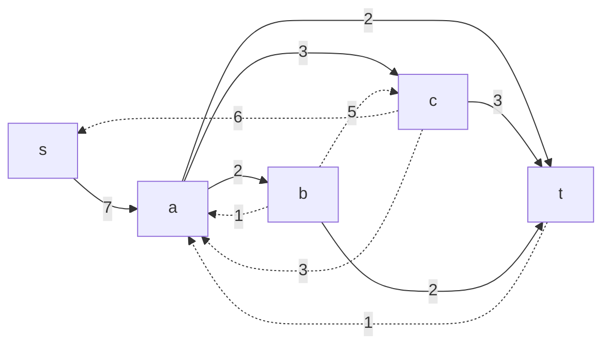
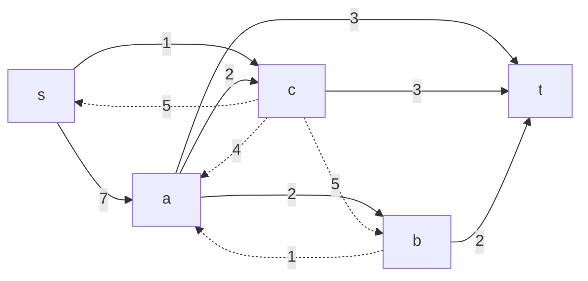
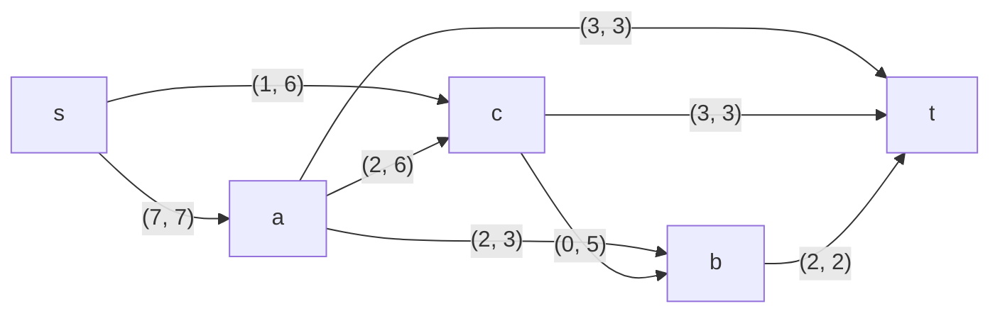

Вариант 1.

Пропускная способность дуг сети указана в таблице.

| Дуги | sa | sc | ab | ac | at | bc | bt | ct |
|------|----|----|----|----|----|----|----|----|
| Пропускная способность | 7 | 6 | 3 | 6 | 3 | 5 | 2 | 3 |

1. Построим сеть с источником s, стоком t и указанными пропускными способностями дуг.

Построим остаточную сеть.

2. Проведем поиск увеличивающего пути в остаточной сети.

В остаточной сети найден увеличивающий путь t -> b -> a -> s. Минимальный вес дуг на этом пути равен 2.

Получим такую остаточную сеть:

3. Продолжим поиск увеличивающего пути в остаточной сети.

В остаточной сети найден увеличивающий путь t -> c -> a -> s. Минимальный вес дуг на этом пути равен 3.

Получим такую остаточную сеть:

4. Продолжим поиск увеличивающего пути в остаточной сети.

В остаточной сети найден увеличивающий путь t -> a -> s. Минимальный вес дуг на этом пути равен 2.

Получим такую остаточную сеть:

5. Продолжим поиск увеличивающего пути в остаточной сети.
  

В остаточной сети найден увеличивающий путь t -> a -> c -> s. Минимальный вес дуг на этом пути равен 1.

Получим такую остаточную сеть:

Величина максимального потока в сети 7 + 1 = 8; 3 + 2 + 3 = 8

6. Проверим значение максимального потока перебором всех разрезов сети.

|   | V1 |
|---|----|
| s | -  |
| s | a  |
| s | b  |
| s | c  |
| s | ab |
| s | bc |
| s | ca |
| s | abc|

|    |    | V2 |
|----|----|----|
| 13 | t  | abc|
| 18 | t  | bc |
| 20 | t  | ac |
| 10 | t  | ab |
| 22 | t  | c  |
| 12 | t  | a  |
| 9  | t  | b  |
| 8  | t  | -  |

Минимальная пропускная способность разреза равна 8 ( {s, a, b, c} / {t} ), что совпадает с найденной величиной максимального потока в сети.

Ответ: Максимальный поток в сети равен 8, он реализуется следующим локальными потоками:

